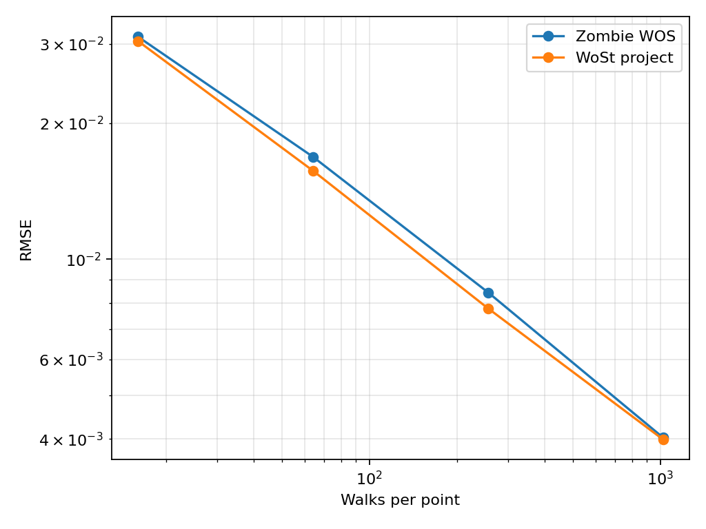
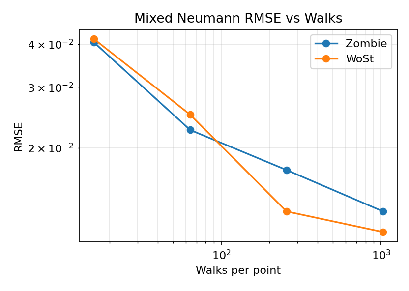
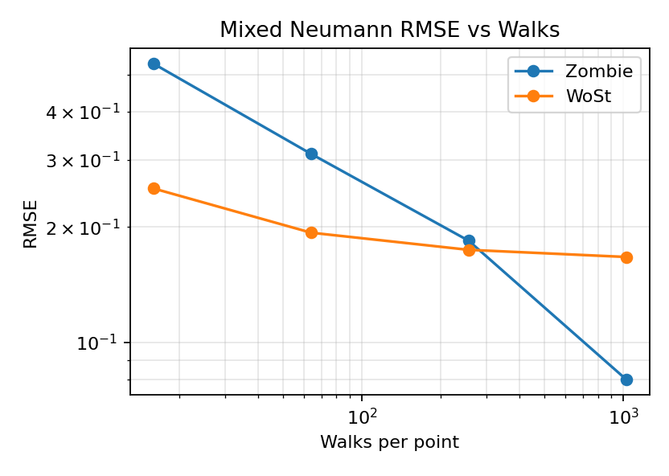
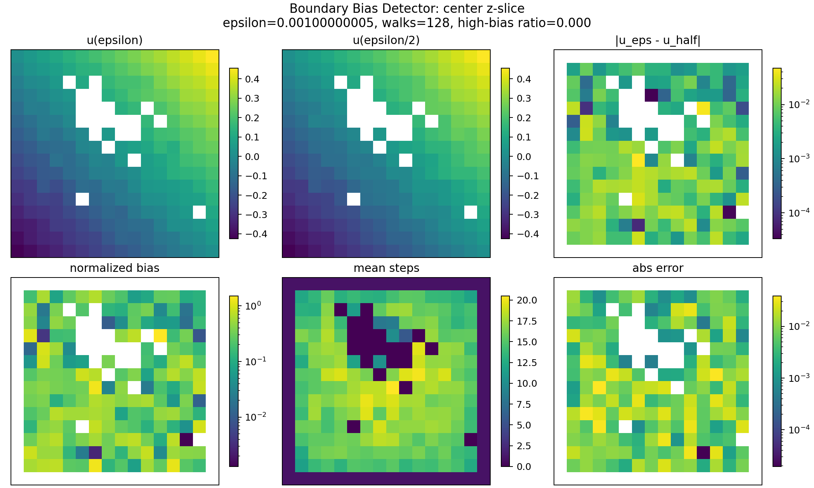
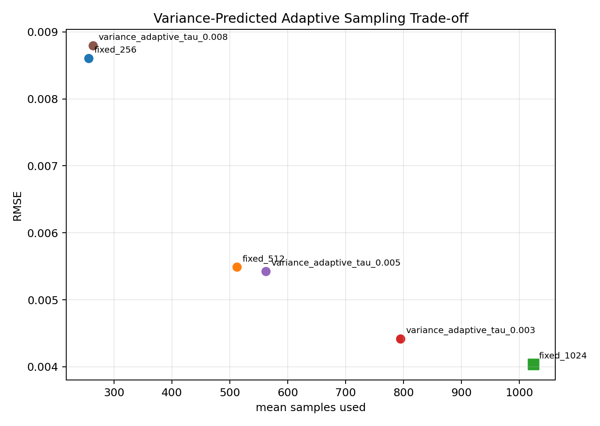
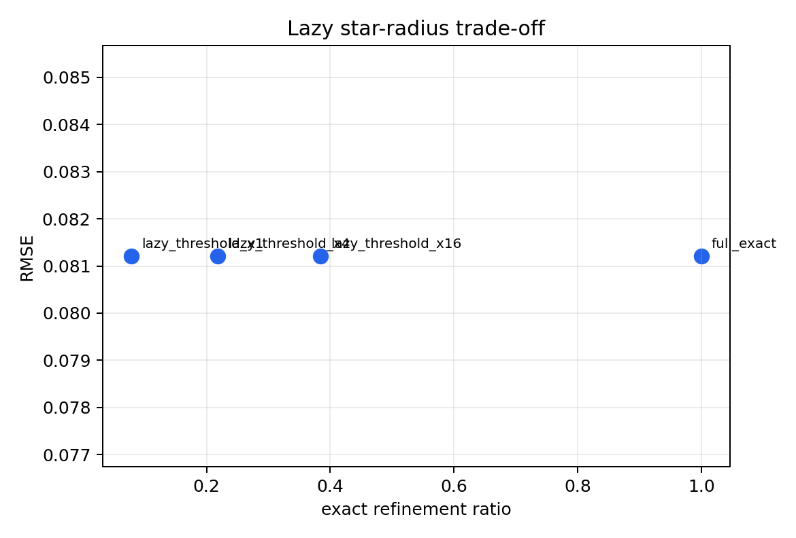
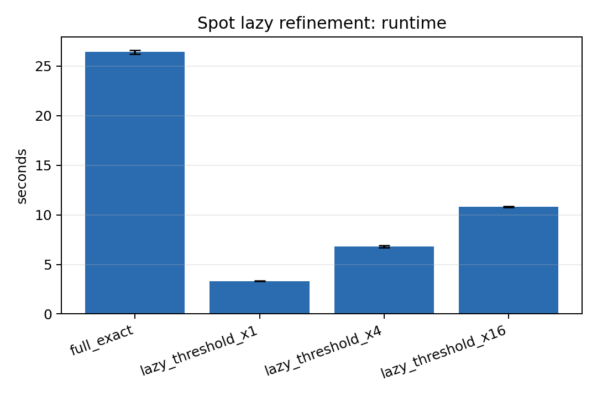
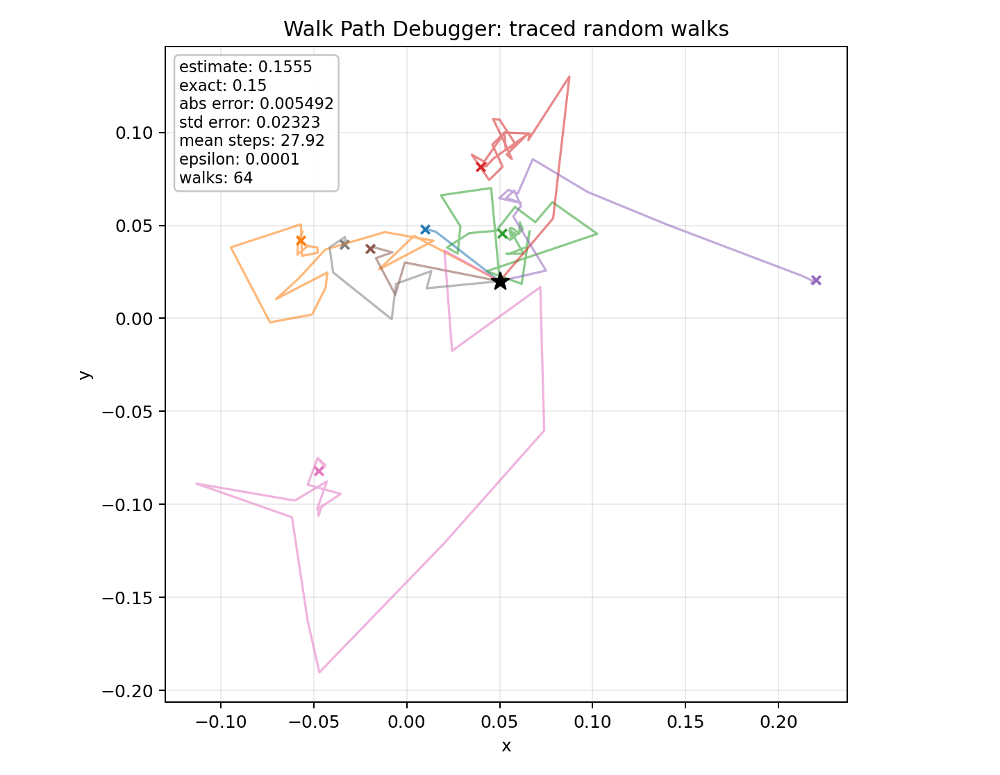

# Final Cross-Mesh Report: Self-Diagnostic and Optimization-Aware WoSt

Generated on 2026-06-03.

This final report integrates:

- Bunny integrated report: `experiments/final_integrated_report.md`
- Spot re-run report: `experiments/spot_mesh_report_20260603/spot_experiment_report.md`
- Cross-mesh consistency analysis: `experiments/spot_mesh_report_20260603/cross_mesh_consistency_analysis.md`

All figures used here are copied into:

```text
experiments/final_cross_mesh_report_20260603/figures/
```

## 1. Final Project Positioning

The final project should be presented as:

```text
A Self-Diagnostic and Optimization-Aware Walk-on-Stars Solver for Complex Mesh Domains
```

The base Walk-on-Stars estimator is not claimed as the sole innovation. The contribution is a C++ WoSt system that can:

- reproduce and compare against Zombie on complex meshes;
- diagnose boundary bias with `epsilon` vs `epsilon/2`;
- visualize actual random walk paths for live explanation;
- predict sample allocation from pilot variance;
- expose optimization diagnostics such as antithetic sampling and lazy star-radius refinement.

## 2. Meshes and Setup

| Mesh | Vertices | Faces | Outer cube | Role |
|---|---:|---:|---:|---|
| Bunny | 35,292 | 70,580 | `[-0.22,0.22]^3` | high-resolution primary benchmark |
| Spot | 2,930 | 5,856 | `[-1.1,1.1]^3` | second mesh for cross-mesh validation |

Both use the analytic solution:

```text
u(x,y,z) = x + y + z
Delta u = 0
```

Boundary settings:

- Dirichlet-only: inner mesh and outer cube use exact Dirichlet data.
- Mixed Neumann: inner mesh is Neumann with `h=(1,1,1) dot n`, outer cube is Dirichlet.

## 3. Main Cross-Mesh Conclusions

### 3.1 Stable Conclusions

The following conclusions are consistent on both Bunny and Spot:

1. **Dirichlet validation is stable.** WoSt and Zombie agree closely on clean Dirichlet benchmarks.
2. **Monte Carlo convergence is visible.** RMSE decreases as walks per query increase.
3. **BVH acceleration matters.** tiny_bvh is faster than brute-force distance queries on both meshes.
4. **Coarse Neumann epsilon causes bias.** WoSt has large mixed-Neumann error at coarse `epsilon=1e-2`, especially on Spot.
5. **Antithetic sampling and lazy refinement remain useful.** Antithetic sampling reduces variance; lazy refinement reduces geometric cost while preserving RMSE in diagnostics.

### 3.2 Mesh-Sensitive Conclusions

The Spot re-run refines several Bunny-only claims:

1. **WoSt Neumann accuracy is not uniformly better.** WoSt is faster and uses shorter paths on both meshes, but Zombie is more accurate at 1024 walks on Spot.
2. **Variance-adaptive sample reduction depends on mesh and target error.** Bunny `tau=0.005` reduces mean samples to `562.48`; Spot `tau=0.005` still uses `954.20` samples on average.
3. **Boundary bias strength is mesh-dependent.** Under comparable demo settings, Spot has larger mean bias than Bunny.

Recommended final wording:

```text
Across Bunny and Spot, WoSt agrees closely with Zombie on clean Dirichlet benchmarks and follows the expected Monte Carlo convergence trend. Mixed Neumann problems are more geometry-sensitive: WoSt consistently uses shorter reflected paths and is much faster, but its accuracy advantage depends on mesh, epsilon, and reflection behavior. The new diagnostic tools are useful precisely because they expose these mesh-dependent bias and variance effects.
```

## 4. Dirichlet Accuracy: Consistent Across Meshes

### 4.1 Bunny

| Walks | Zombie RMSE | WoSt RMSE | Zombie / WoSt |
|---:|---:|---:|---:|
| 16 | 0.03110 | 0.03042 | 1.022 |
| 64 | 0.01685 | 0.01570 | 1.073 |
| 256 | 0.00845 | 0.00778 | 1.085 |
| 1024 | 0.00403 | 0.00399 | 1.010 |



### 4.2 Spot

| Walks | Zombie RMSE | WoSt RMSE | Zombie / WoSt |
|---:|---:|---:|---:|
| 16 | 0.12587 | 0.11582 | 1.087 |
| 64 | 0.06596 | 0.05978 | 1.103 |
| 256 | 0.03002 | 0.03078 | 0.976 |
| 1024 | 0.01426 | 0.01517 | 0.940 |


Analysis:

- Both meshes show the expected Monte Carlo convergence pattern.
- Bunny and Spot differ in absolute RMSE scale because their domain sizes and query distributions differ.
- The relative agreement between WoSt and Zombie remains stable.

## 5. Mixed Neumann: Faster WoSt, Mesh-Sensitive Accuracy

### 5.1 Bunny

| Walks | Zombie RMSE | WoSt RMSE | Zombie steps | WoSt steps | Zombie time | WoSt time |
|---:|---:|---:|---:|---:|---:|---:|
| 16 | 0.04048 | 0.04140 | 282.19 | 30.93 | 2.06s | 1.11s |
| 64 | 0.02254 | 0.02497 | 227.22 | 33.52 | 6.76s | 4.44s |
| 256 | 0.01726 | 0.01308 | 238.82 | 34.46 | 28.00s | 17.20s |
| 1024 | 0.01309 | 0.01141 | 239.65 | 34.47 | 111.35s | 71.06s |



### 5.2 Spot

| Walks | Zombie RMSE | WoSt RMSE | Zombie steps | WoSt steps | Zombie time | WoSt time |
|---:|---:|---:|---:|---:|---:|---:|
| 16 | 0.53373 | 0.25217 | 354.5 | 107.9 | 4.08s | 0.27s |
| 64 | 0.31045 | 0.19335 | 366.8 | 104.4 | 16.90s | 1.14s |
| 256 | 0.18426 | 0.17442 | 367.9 | 107.6 | 65.30s | 4.57s |
| 1024 | 0.08007 | 0.16710 | 367.8 | 106.2 | 259.03s | 17.86s |



Analysis:

- On both meshes, WoSt uses much shorter reflected paths and is much faster.
- On Bunny, WoSt is also more accurate at 256 and 1024 walks.
- On Spot, Zombie becomes more accurate at 1024 walks, so the Neumann accuracy claim must be mesh-sensitive.

Safe claim:

```text
WoSt is consistently faster in mixed Neumann tests because it uses shorter reflected paths, but its accuracy advantage depends on the mesh and epsilon.
```

## 6. Epsilon Bias: Stronger on Spot

### 6.1 Bunny Neumann Epsilon Sweep

| Epsilon | Zombie RMSE | WoSt RMSE | Zombie steps | WoSt steps |
|---:|---:|---:|---:|---:|
| 1e-2 | 0.01664 | 0.15294 | 109.81 | 6.75 |
| 1e-3 | 0.01280 | 0.02676 | 235.35 | 15.90 |
| 1e-4 | 0.01532 | 0.01249 | 251.10 | 32.21 |
| 1e-5 | 0.01418 | 0.01398 | 257.10 | 48.88 |


### 6.2 Spot Neumann Epsilon Sweep

| Epsilon | Zombie RMSE | WoSt RMSE | Zombie steps | WoSt steps |
|---:|---:|---:|---:|---:|
| 1e-2 | 0.19283 | 0.62693 | 353.1 | 11.7 |
| 1e-3 | 0.17747 | 0.23421 | 361.4 | 38.6 |
| 1e-4 | 0.15249 | 0.18677 | 369.3 | 102.3 |
| 1e-5 | 0.14985 | 0.18768 | 379.1 | 134.8 |


Analysis:

- Both meshes show severe WoSt coarse-epsilon bias at `1e-2`.
- Spot makes the problem harder: even at smaller epsilon, residual Neumann error remains higher than Bunny.
- This supports the boundary-bias detector as a practical diagnostic, not just a visualization feature.

## 7. Boundary Bias Detector

The detector computes:

```text
bias = |u_epsilon - u_epsilon/2|
normalized_bias = bias / (stdErr_epsilon + stdErr_epsilon_half + 1e-6)
```

| Mesh | Grid | Walks | Mean bias | Max bias | RMSE epsilon | RMSE epsilon/2 |
|---|---:|---:|---:|---:|---:|---:|
| Bunny | 16 | 128 | 0.00601 | 0.06463 | 0.01045 | 0.01023 |
| Spot | 16 | 128 | 0.02392 | 0.20125 | 0.03901 | 0.03839 |

| Bunny | Spot |
|---|---|
|  |  |

Analysis:

- The same diagnostic shows stronger epsilon sensitivity on Spot.
- This strengthens the central project claim: the solver should diagnose mesh-dependent bias rather than hide it.

## 8. Variance-Predicted Adaptive Sampling

### 8.1 Bunny

| Method | RMSE | Mean samples | Runtime |
|---|---:|---:|---:|
| fixed_1024 | 0.00404 | 1024.00 | 53.97s |
| adaptive tau=0.003 | 0.00442 | 794.80 | 45.81s |
| adaptive tau=0.005 | 0.00543 | 562.48 | 33.20s |
| adaptive tau=0.008 | 0.00880 | 263.78 | 16.58s |




### 8.2 Spot

| Method | RMSE | Mean samples | Runtime |
|---|---:|---:|---:|
| fixed_1024 | 0.01518 | 1024.00 | 7.96s |
| adaptive tau=0.003 | 0.01523 | 990.47 | 6.60s |
| adaptive tau=0.005 | 0.01538 | 954.20 | 6.37s |
| adaptive tau=0.008 | 0.01581 | 899.57 | 6.11s |


Analysis:

- Bunny gets a clear cost/accuracy trade-off: `tau=0.005` reduces samples by about 45%.
- Spot gets much smaller sample savings because the pilot variance predicts that most points need near-maximum sampling.
- This does not invalidate the method. It shows the method is diagnostic: it reveals when a mesh is harder under a given error target.

Safe claim:

```text
Variance-predicted adaptive sampling allocates samples according to estimated difficulty, but the actual sample reduction is mesh- and threshold-dependent.
```

## 9. Other Optimization Diagnostics

### 9.1 Antithetic Sampling

| Mesh | Normal variance | Antithetic variance | Conclusion |
|---|---:|---:|---|
| Bunny | see figure | lower | reduces variance |
| Spot | 0.24709 | 0.06820 | strongly reduces variance |

| Bunny | Spot |
|---|---|
|  |  |

### 9.2 Lazy Star-Radius Refinement

| Mesh | Full exact runtime | Lazy x1 runtime | RMSE impact |
|---|---:|---:|---|
| Bunny | 0.5697s | 0.0692s | same RMSE in diagnostic |
| Spot | 26.43s | 3.32s | same RMSE in diagnostic |

| Bunny | Spot |
|---|---|
|  |  |

Analysis:

- Antithetic sampling and lazy refinement are the most robust optimization results across both meshes.
- Lazy refinement is especially important on Spot because full exact star-radius refinement is much more expensive there.

## 10. Live Walk Path Debugger

| Mesh | Point | Walks | Runtime | Purpose |
|---|---|---:|---:|---|
| Bunny | `(0.05,0.02,0.08)` | 64 | 0.0509s | live demo and interpretability |
| Spot | `(0.8,0.0,0.2)` | 64 | 0.0043s | live demo and interpretability |

| Bunny | Spot |
|---|---|
|  |  |

Analysis:

- The walk path debugger is fast enough for live presentation on both meshes.
- It turns WoSt from a black-box estimator into a visually explainable stochastic process.

## 11. Final Claims

### Safe Claims

- WoSt and Zombie agree closely on Dirichlet benchmarks across Bunny and Spot.
- WoSt follows the expected Monte Carlo convergence trend.
- Mixed Neumann behavior is more geometry-sensitive than Dirichlet behavior.
- WoSt is consistently faster in mixed Neumann tests because it uses shorter reflected paths.
- WoSt's Neumann accuracy advantage is mesh-dependent.
- Coarse epsilon can cause severe boundary bias; epsilon-vs-half-epsilon comparison detects this sensitivity.
- Antithetic sampling and lazy star-radius refinement remain robust optimization diagnostics.
- Variance-predicted adaptive sampling should be tuned per mesh and target error.
- The new live diagnostics justify the final framing as a self-diagnostic and optimization-aware solver.

### Avoid Overclaiming

- Do not claim WoSt is always more accurate than Zombie for Neumann problems.
- Do not claim variance-adaptive sampling always reduces mean samples to 300--700.
- Do not claim a pure backend-only Zombie FCPW vs WoSt tiny_bvh comparison; Zombie timings go through Python scripts.
- Do not claim million-triangle scalability without a million-triangle experiment.

## 12. Final Summary

The combined Bunny and Spot evidence supports a stronger, more nuanced final story:

```text
WoSt is validated against Zombie on clean Dirichlet problems across multiple complex meshes. For mixed Neumann problems, WoSt is consistently faster and uses shorter paths, but accuracy depends on mesh geometry and epsilon. This mesh sensitivity motivates the new self-diagnostic tools: walk-path tracing, boundary-bias detection, and variance-predicted adaptive sampling. Antithetic sampling and lazy star-radius refinement provide robust optimization diagnostics, while adaptive sampling should be tuned per mesh and target error.
```

The Spot report does not invalidate the Bunny report. It strengthens the project by showing why a self-diagnostic WoSt solver is valuable: different meshes expose different bias, variance, and cost regimes.

## 13. Key Files

Reports:

```text
experiments/final_integrated_report.md
experiments/spot_mesh_report_20260603/spot_experiment_report.md
experiments/spot_mesh_report_20260603/cross_mesh_consistency_analysis.md
experiments/final_cross_mesh_report_20260603/final_cross_mesh_report.md
```

Figure folder:

```text
experiments/final_cross_mesh_report_20260603/figures/
```

