# Geometry-Sensitive Rerun Analysis

This analysis is saved separately from the original rerun results. It reads the 2026-06-06 rerun outputs and writes derived geometry-correlation tables, binned summaries, plots, and an extra coarse-epsilon boundary-bias detector run.

## What to Supplement

- Add geometry-causality diagnostics: correlate pointwise Neumann error, epsilon bias, mean steps, pilot variance, and sample allocation with local mesh features.
- Add pointwise Neumann diagnostics, not only summary RMSE tables.
- Add coarse-vs-finer boundary-bias maps to separate epsilon bias from Monte Carlo variance.
- Add mesh-quality/normal-variation summaries so Bunny and Spot conclusions are tied to measurable mesh properties.
- Optional future work: add more meshes or remeshed variants to avoid overclaiming Bunny/Spot-specific correlations.

## Visual Summary

The main evidence is organized visually first, with tables kept below each figure as numerical backup.

| Question | Recommended figure | Reading guide |
|---|---|---|
| Are Bunny and Spot geometrically different? | `figures/mesh_feature_comparison.png` | Spot is coarser and has higher normal variation, so raw cross-mesh comparisons mix shape, mesh quality, and query placement. |
| What pointwise feature predicts difficult Neumann queries? | `figures/neumann_pointcloud_abs_error_scatter.png` | Normalized nearest-surface distance is the clearest predictor of pointwise Neumann error. |
| Does boundary bias concentrate near the boundary? | `figures/bias_eps_1e-3_bias_indicator_scatter.png` | Boundary-bias indicators increase near the inner surface. |
| Does Spot remain harder after distance matching? | `../controlled_geometry_experiments_20260606/plots/matched_bins_bunny_vs_spot_abs_error.png` | Spot remains higher-error in matched bins 1-3, but the gap shrinks with distance. |
| Is epsilon bias distance-dependent? | `../controlled_geometry_experiments_20260606/epsilon_distance_heatmaps/*_epsilon_vs_distance_rmse.png` | Coarse epsilon is most damaging in close-distance bins. |

## Mesh Feature Comparison

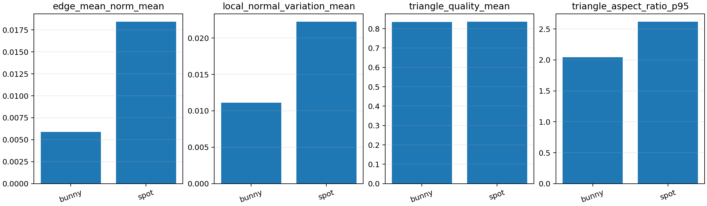

**Figure.** Bunny and Spot differ in triangle count, normalized edge size, normal variation, and aspect-ratio tail; this motivates controlled distance-bin experiments before making cross-mesh claims.

| Mesh | Faces | bbox diag | edge mean norm | normal variation mean | local normal variation mean | quality mean | aspect p95 |
|---|---:|---:|---:|---:|---:|---:|---:|
| bunny | 70580 | 0.250034 | 0.00588519 | 0.0110946 | 0.0110946 | 0.835094 | 2.04474 |
| spot | 5856 | 2.58809 | 0.0184246 | 0.0222255 | 0.0222255 | 0.835319 | 2.61664 |

## Main Sensitivity Evidence

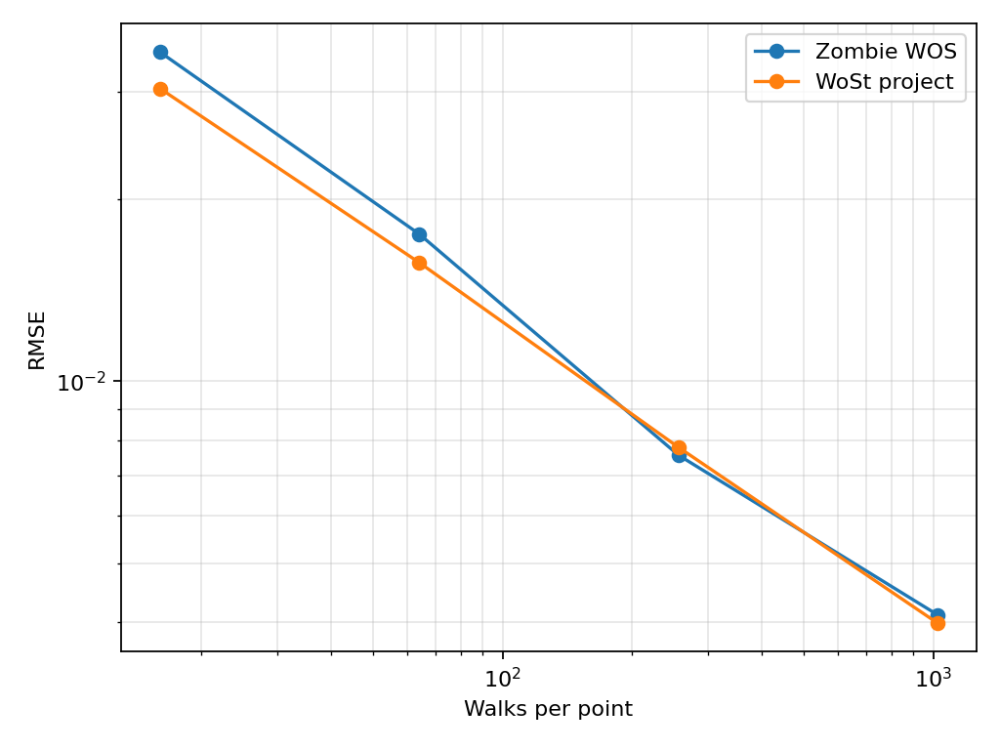

**Figure.** Bunny Dirichlet convergence behaves as expected, validating the baseline Monte Carlo pipeline before interpreting Neumann sensitivity.

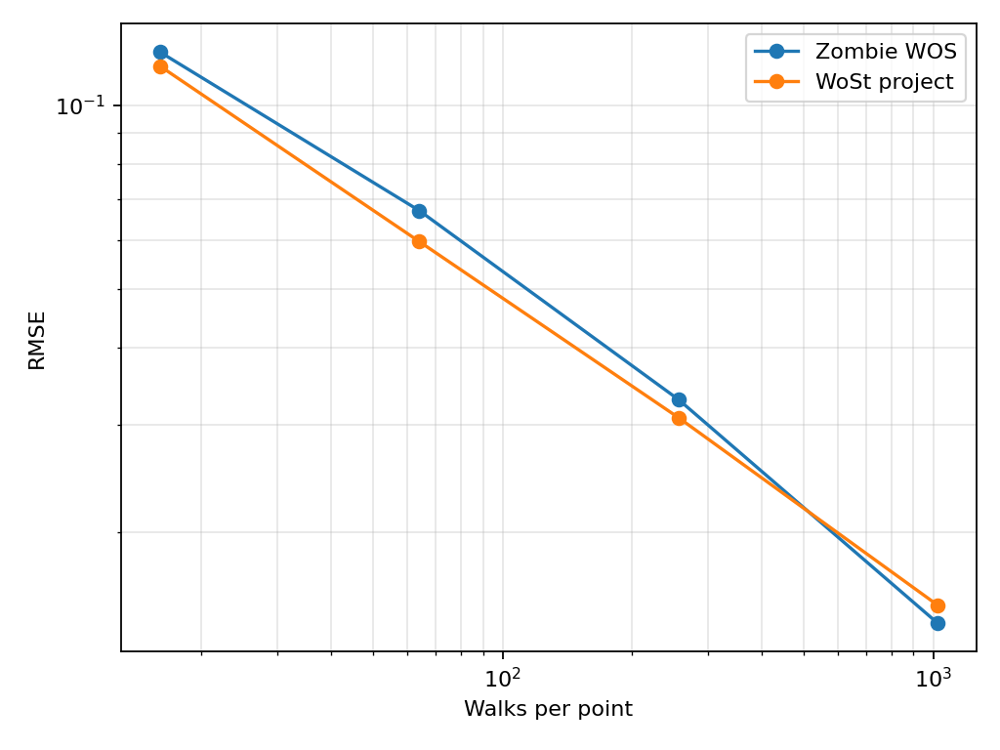

**Figure.** Spot Dirichlet convergence also follows the expected trend, so the later difficulty is not simply a broken base estimator.

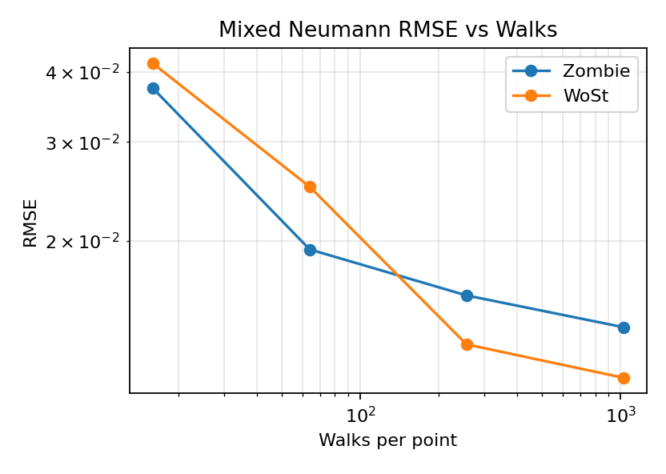

**Figure.** Bunny Mixed Neumann convergence is less clean than Dirichlet convergence, consistent with boundary/reflection sensitivity.

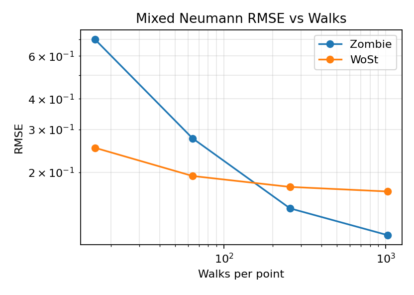

**Figure.** Spot Mixed Neumann remains harder, motivating the controlled distance-bin experiment below.

| Mesh | Case | Key ratio / metric | Interpretation |
|---|---|---:|---|
| bunny | dirichlet 16->1024 | 7.628 | expected Dirichlet convergence |
| bunny | neumann 16->1024 | 3.629 | Monte Carlo convergence; low value indicates residual floor |
| bunny | dirichlet_epsilon_sweep 1e-2 / 1e-4 | 1.098 | large means coarse-epsilon bias dominates |
| bunny | neumann_epsilon_sweep 1e-2 / 1e-4 | 12.249 | large means coarse-epsilon bias dominates |
| spot | dirichlet 16->1024 | 7.633 | expected Dirichlet convergence |
| spot | neumann 16->1024 | 1.509 | Monte Carlo convergence; low value indicates residual floor |
| spot | dirichlet_epsilon_sweep 1e-2 / 1e-4 | 0.995 | large means coarse-epsilon bias dominates |
| spot | neumann_epsilon_sweep 1e-2 / 1e-4 | 3.357 | large means coarse-epsilon bias dominates |

## Extra Boundary-Bias Runs

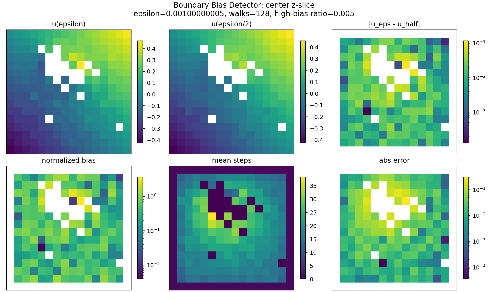

**Figure.** Bunny boundary-bias detector visualizes where epsilon-vs-half-epsilon estimates disagree, highlighting boundary-sensitive regions.

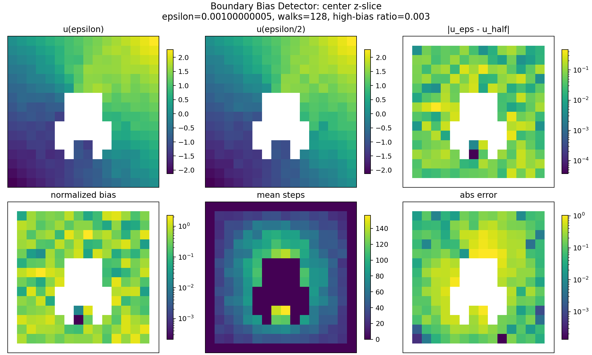

**Figure.** Spot shows larger boundary-bias structure in the diagnostic run, consistent with the controlled-bin bias table later in the report.

| Mesh | Epsilon | Mean bias | Max bias | RMSE eps | RMSE eps/2 |
|---|---:|---:|---:|---:|---:|
| bunny | 1e-02 | 0.03847 | 1.61495 | 0.19977 | 0.11089 |
| bunny | 1e-03 | 0.00942 | 0.19949 | 0.03247 | 0.02280 |
| spot | 1e-02 | 0.10919 | 1.38271 | 0.53977 | 0.35781 |
| spot | 1e-03 | 0.04337 | 0.60245 | 0.19807 | 0.17550 |

## Strongest Correlations

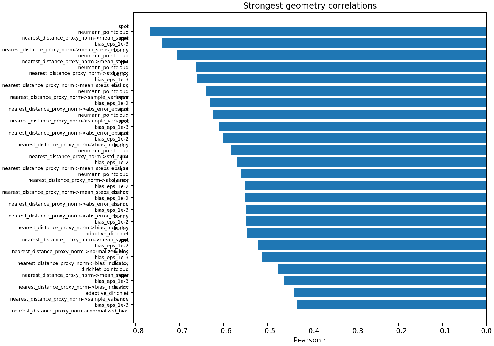

**Figure.** The strongest correlations are dominated by normalized nearest-surface distance, especially for Neumann error, boundary bias, path length, and variance-related quantities.

### Neumann Pointwise Error

**Figure.** Pointwise Neumann error is highest for queries close to the inner mesh; local normal variation is useful but visibly weaker as a standalone predictor.

| Mesh | Feature | Pearson r | n |
|---|---|---:|---:|
| spot | nearest_distance_proxy_norm | -0.560 | 94 |
| bunny | nearest_distance_proxy_norm | -0.361 | 99 |
| spot | local_normal_variation | -0.121 | 94 |
| spot | local_edge_mean_norm | 0.097 | 94 |
| spot | local_area_norm | 0.081 | 94 |
| bunny | local_normal_variation | 0.043 | 99 |
| bunny | local_aspect_ratio | 0.042 | 99 |
| bunny | local_area_norm | 0.034 | 99 |

### Boundary Bias

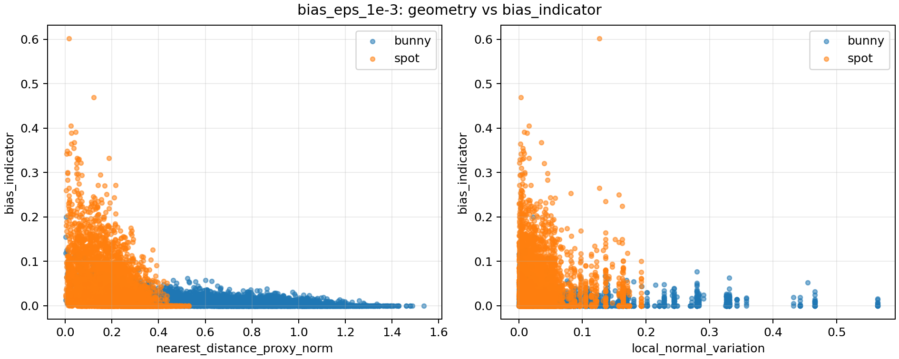

**Figure.** Boundary-bias indicators increase near the inner surface, supporting the epsilon-by-distance sweep.

| Mesh | Dataset | Feature | Pearson r | n |
|---|---|---|---:|---:|
| spot | bias_eps_1e-2 | nearest_distance_proxy_norm | -0.600 | 3876 |
| bunny | bias_eps_1e-2 | nearest_distance_proxy_norm | -0.548 | 4018 |
| bunny | bias_eps_1e-3 | nearest_distance_proxy_norm | -0.512 | 4018 |
| spot | bias_eps_1e-3 | nearest_distance_proxy_norm | -0.461 | 3876 |
| spot | bias_eps_1e-2 | local_normal_variation | -0.193 | 3876 |
| spot | bias_eps_1e-3 | local_normal_variation | -0.152 | 3876 |
| spot | bias_eps_1e-2 | local_aspect_ratio | 0.118 | 3876 |
| spot | bias_eps_1e-3 | local_edge_mean_norm | 0.107 | 3876 |
| spot | bias_eps_1e-3 | local_area_norm | 0.099 | 3876 |
| spot | bias_eps_1e-2 | local_quality | -0.090 | 3876 |

### Adaptive Variance

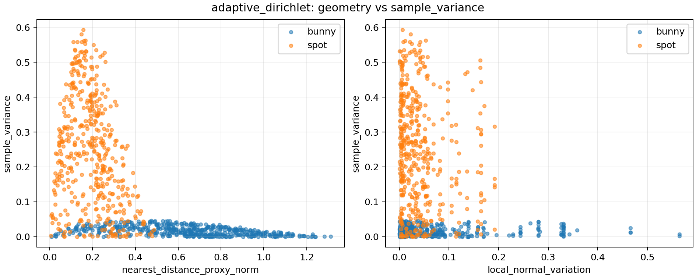

**Figure.** Adaptive sampling reacts to variance structure; this supports framing adaptive sampling as a diagnostic/allocation tool rather than a universal accuracy guarantee.

| Mesh | Feature | Pearson r with sample variance | n |
|---|---|---:|---:|
| bunny | nearest_distance_proxy_norm | -0.438 | 490 |
| spot | nearest_distance_proxy_norm | -0.289 | 459 |
| spot | local_edge_mean_norm | 0.227 | 459 |
| spot | local_area_norm | 0.208 | 459 |
| spot | local_aspect_ratio | 0.153 | 459 |
| spot | local_normal_variation | -0.143 | 459 |
| bunny | local_aspect_ratio | 0.122 | 490 |
| bunny | local_quality | -0.116 | 490 |

## Near-Boundary Binned Evidence

Rows are quartiles of the normalized nearest-surface distance proxy. Bin 1 is closest to the mesh. The monotone drop from bin 1 to bin 4 is the clearest pointwise evidence that near-boundary geometry drives high error, high bias, and long paths.

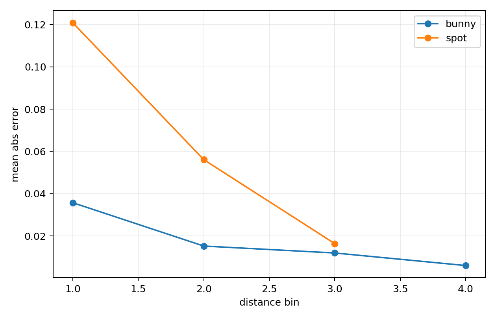

**Figure.** Mean Neumann error drops as normalized distance increases, with Spot consistently harder in the matched bins where both meshes have feasible samples.

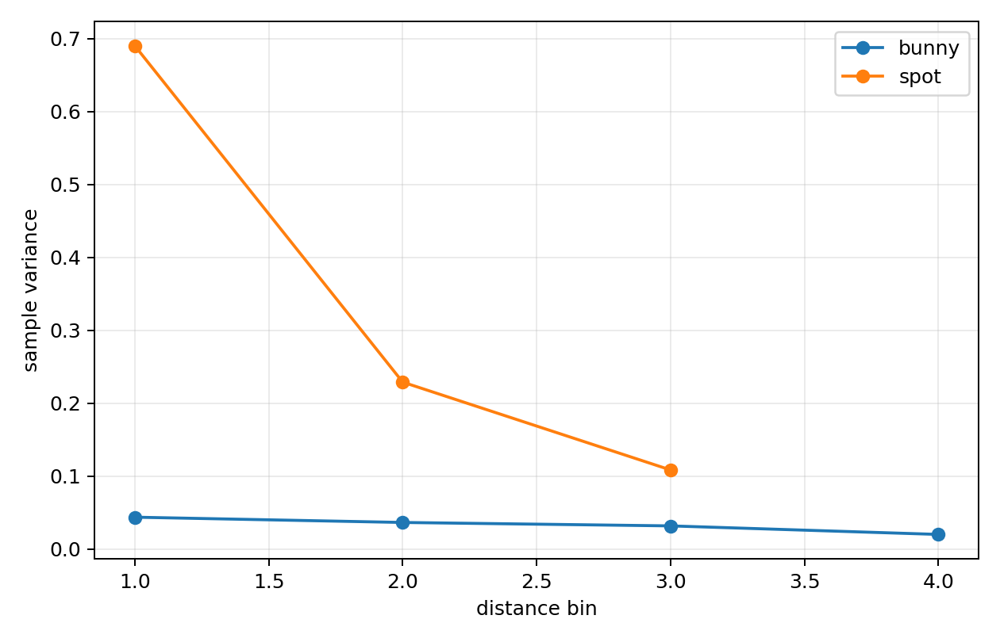

**Figure.** Sample variance is also largest near the boundary, especially on Spot.

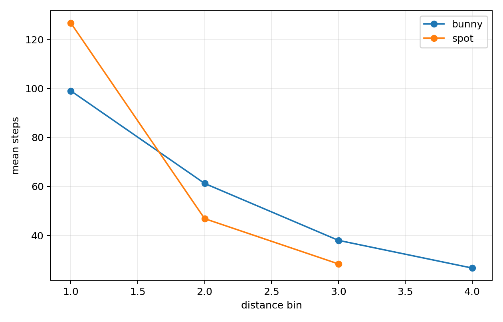

**Figure.** Mean walk length is highest for close-boundary queries; distance matching reduces but does not remove cross-mesh differences.

| Mesh | Dataset | Distance bin | Mean abs error | Mean bias | Mean sample variance | Mean samples | Mean steps |
|---|---|---:|---:|---:|---:|---:|---:|
| bunny | neumann_pointcloud | 1 | 0.013201 | nan | 0.042107 | 256 | 61.929 |
| bunny | neumann_pointcloud | 2 | 0.008777 | nan | 0.023182 | 256 | 31.09 |
| bunny | neumann_pointcloud | 3 | 0.0067897 | nan | 0.014013 | 256 | 22.81 |
| bunny | neumann_pointcloud | 4 | 0.0057042 | nan | 0.01037 | 256 | 21.863 |
| bunny | adaptive_dirichlet | 1 | 0.0060448 | nan | 0.02304 | 374.64 | 23.725 |
| bunny | adaptive_dirichlet | 2 | 0.0070316 | nan | 0.020938 | 330.58 | 21.933 |
| bunny | adaptive_dirichlet | 3 | 0.0070197 | nan | 0.014331 | 221.16 | 20.417 |
| bunny | adaptive_dirichlet | 4 | 0.0058393 | nan | 0.0079552 | 128.95 | 19.032 |
| bunny | bias_eps_1e-2 | 1 | nan | 0.11614 | nan | nan | nan |
| bunny | bias_eps_1e-2 | 2 | nan | 0.023854 | nan | nan | nan |
| bunny | bias_eps_1e-2 | 3 | nan | 0.010238 | nan | nan | nan |
| bunny | bias_eps_1e-2 | 4 | nan | 0.0036132 | nan | nan | nan |
| spot | neumann_pointcloud | 1 | 0.22578 | nan | 0.85291 | 256 | 205.34 |
| spot | neumann_pointcloud | 2 | 0.11571 | nan | 0.66534 | 256 | 117.97 |
| spot | neumann_pointcloud | 3 | 0.071742 | nan | 0.41302 | 256 | 71.657 |
| spot | neumann_pointcloud | 4 | 0.023893 | nan | 0.15985 | 256 | 34.323 |
| spot | adaptive_dirichlet | 1 | 0.010891 | nan | 0.24043 | 927.79 | 26.745 |
| spot | adaptive_dirichlet | 2 | 0.013502 | nan | 0.337 | 955.27 | 26.879 |
| spot | adaptive_dirichlet | 3 | 0.012556 | nan | 0.27302 | 988.55 | 26.202 |
| spot | adaptive_dirichlet | 4 | 0.009994 | nan | 0.134 | 728.56 | 23.615 |
| spot | bias_eps_1e-2 | 1 | nan | 0.27986 | nan | nan | nan |
| spot | bias_eps_1e-2 | 2 | nan | 0.10113 | nan | nan | nan |
| spot | bias_eps_1e-2 | 3 | nan | 0.045369 | nan | nan | nan |
| spot | bias_eps_1e-2 | 4 | nan | 0.010395 | nan | nan | nan |

## Conclusions

- The strongest and most stable pointwise predictor is proximity to the inner mesh. The normalized nearest-surface distance proxy has strong negative correlation with Neumann mean steps, sample variance, pointwise error, and boundary-bias magnitude: closer points are harder.
- Spot is harder in absolute error because its tested query distribution is much closer to the inner mesh in normalized units: the Spot neumann-pointcloud median distance proxy is about `0.176`, while Bunny's is about `0.654`. This places far more Spot queries in reflection-heavy, boundary-sensitive regions.
- Mesh-level features add another layer: compared with Bunny, Spot is much coarser relative to object scale (`edge_mean_norm_mean` about 3.1x larger), has about 2x mean normal variation, and has a larger p95 aspect ratio. These traits plausibly amplify Neumann sensitivity once paths interact with the boundary.
- Coarse epsilon is a first-order driver for Neumann error on both meshes. Spot has larger absolute coarse-epsilon RMSE and larger absolute boundary-bias magnitude, while Bunny has the larger relative `1e-2 / 1e-4` RMSE ratio because its fine-epsilon Neumann RMSE is much lower.
- Local normal variation is useful but incomplete as a pointwise proxy. It is weaker than nearest-surface distance in these tests, so the safest explanation is boundary proximity plus coarser/more angular mesh geometry, not normal variation alone.
- Adaptive sampling behavior is mostly variance-driven. Sample allocation correlates with pointwise sample variance and near-boundary distance more clearly than with any single triangle-quality scalar.
- These are empirical Bunny/Spot conclusions. A stronger causal claim would need remeshed variants of the same shape, synthetic narrow-gap/high-curvature meshes, or normal/orientation perturbation tests.

## Controlled Geometry Findings

Measured outputs are from `experiments/controlled_geometry_experiments_20260606/`. These experiments reduce the nearest-distance confounder by sampling query points from fixed normalized nearest-surface-distance bins, but they do not establish causality.

### Controlled Figure Summary

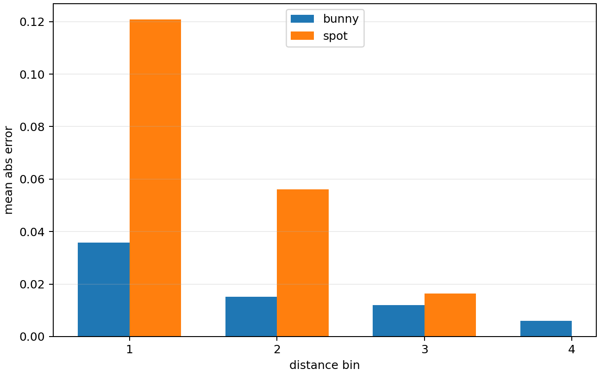

**Figure.** In distance-matched bins 1-3, Spot remains higher-error than Bunny, but the gap narrows in the farther bin.

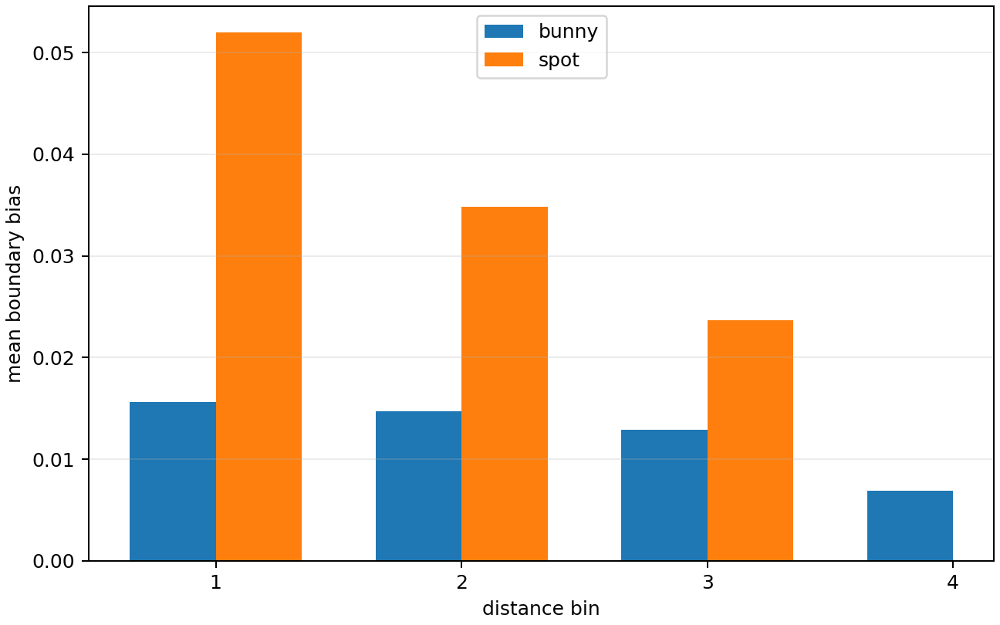

**Figure.** Spot also has larger boundary-bias indicators in matched bins, supporting residual geometry/reflection/normal sensitivity after distance control.

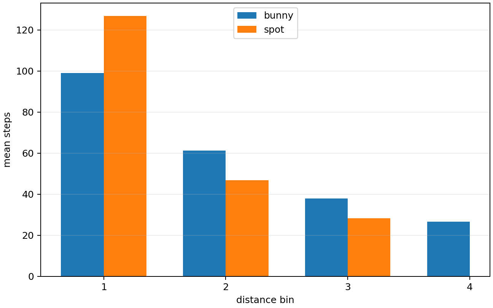

**Figure.** Mean steps are not uniformly larger for Spot after matching distance, so path length alone does not explain the cross-mesh error gap.

### Distance-Controlled Query Counts

| Mesh | Bin | Range | Requested | Sampled | Complete |
|---|---|---|---|---|---|
| bunny | 1 | [0.05, 0.15] | 24 | 24 | 1 |
| bunny | 2 | [0.15, 0.3] | 24 | 24 | 1 |
| bunny | 3 | [0.3, 0.6] | 24 | 24 | 1 |
| bunny | 4 | [0.6, 1.0] | 24 | 24 | 1 |
| spot | 1 | [0.05, 0.15] | 24 | 24 | 1 |
| spot | 2 | [0.15, 0.3] | 24 | 24 | 1 |
| spot | 3 | [0.3, 0.6] | 24 | 24 | 1 |
| spot | 4 | [0.6, 1.0] | 24 | 0 | 0 |

Spot has no sampled points in bin 4 `[0.60, 1.00]` under the current cube and nearest-centroid distance proxy, so matched Bunny-vs-Spot comparisons are limited to bins 1-3. Some sampled points are also outside the valid WoSt domain; the result tables use valid solved points.

### Matched-Bin Neumann Results

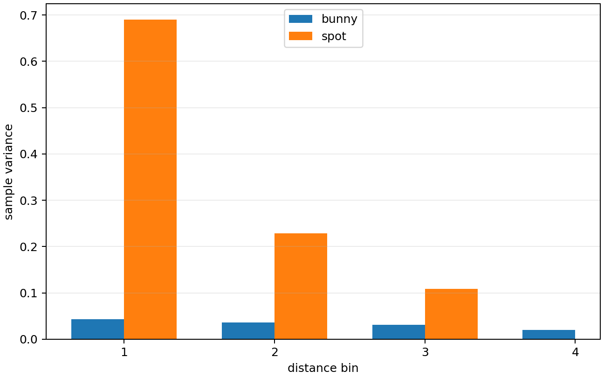

**Figure.** Spot has much larger sample variance in the close and middle bins, matching its larger pointwise Neumann error.

| Mesh | Bin | n | Mean dist | Mean abs err | RMSE | Mean steps | Mean var |
|---|---|---|---|---|---|---|---|
| bunny | 1 | 21 | 0.09189 | 0.03572 | 0.04262 | 99.088 | 0.04353 |
| bunny | 2 | 22 | 0.22002 | 0.01522 | 0.01865 | 61.227 | 0.03628 |
| bunny | 3 | 23 | 0.48488 | 0.01195 | 0.01469 | 37.956 | 0.03158 |
| bunny | 4 | 24 | 0.74727 | 0.00600 | 0.00838 | 26.626 | 0.01987 |
| spot | 1 | 22 | 0.10348 | 0.12087 | 0.16601 | 126.84 | 0.69019 |
| spot | 2 | 24 | 0.24329 | 0.05609 | 0.07475 | 46.831 | 0.22881 |
| spot | 3 | 24 | 0.35756 | 0.01639 | 0.02230 | 28.322 | 0.10831 |

### Matched-Bin Boundary Bias Results

| Mesh | Bin | Mean bias | Max bias |
|---|---|---|---|
| bunny | 1 | 0.01559 | 0.04359 |
| bunny | 2 | 0.01469 | 0.03942 |
| bunny | 3 | 0.01291 | 0.03666 |
| bunny | 4 | 0.00687 | 0.03378 |
| spot | 1 | 0.05200 | 0.13833 |
| spot | 2 | 0.03483 | 0.08968 |
| spot | 3 | 0.02366 | 0.08317 |

### Bunny-vs-Spot Matched-Bin Comparison

| Bin | Error ratio | Bias ratio | Steps ratio | Status |
|---|---|---|---|---|
| 1 | 3.3835 | 3.3343 | 1.2801 | matched |
| 2 | 3.6846 | 2.3709 | 0.76488 | matched |
| 3 | 1.3711 | 1.8329 | 0.74617 | matched |
| 4 | NA | NA | NA | missing mesh/bin pair |

Across matched bins 1-3, Spot/Bunny mean error ratio averages `2.81x`, mean boundary-bias ratio averages `2.51x`, and mean steps ratio averages `0.93x`.

### Epsilon x Distance Sweep

**Figure.** Bunny RMSE is most sensitive to coarse epsilon in close-distance bins; the epsilon effect weakens farther from the boundary.

**Figure.** Spot shows the same coarse-epsilon sensitivity pattern, with high residual RMSE in close bins.

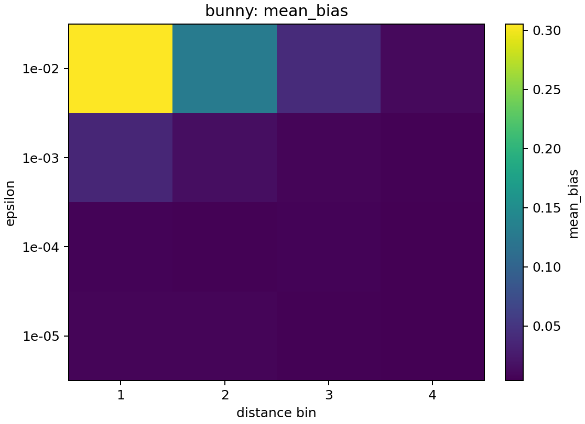

**Figure.** Bunny boundary-bias indicators decrease as epsilon is refined, especially near the boundary.

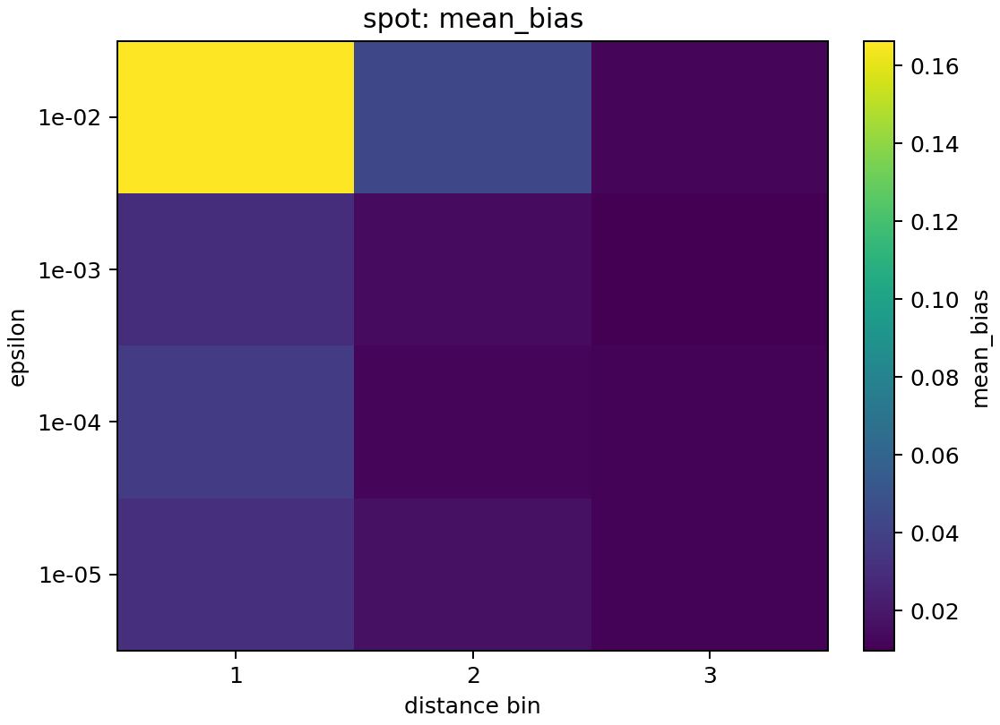

**Figure.** Spot keeps larger close-bin bias indicators, reinforcing that boundary proximity and mesh/shape effects remain entangled.

| Mesh | Bin | RMSE 1e-2 | RMSE 1e-5 | RMSE ratio | Bias ratio |
|---|---|---|---|---|---|
| bunny | 1 | 0.76753 | 0.04366 | 17.581 | 23.386 |
| bunny | 2 | 0.34624 | 0.01774 | 19.522 | 10.363 |
| bunny | 3 | 0.11365 | 0.01077 | 10.555 | 4.3109 |
| bunny | 4 | 0.03720 | 0.01004 | 3.7064 | 1.7757 |
| spot | 1 | 0.54587 | 0.17584 | 3.1044 | 2.7571 |
| spot | 2 | 0.15144 | 0.05658 | 2.6767 | 1.4031 |
| spot | 3 | 0.05623 | 0.02261 | 2.4867 | 1.5345 |

At `walks=256`, coarse epsilon usually increases close-bin RMSE and boundary-bias indicators. The effect is strongest in Bunny bin 1 and visible in Spot bins 1-3, while some far or low-error bins are noisy because estimator variance and valid-point counts are limited. Full heatmaps are in `epsilon_distance_heatmaps/`.

### Controlled Correlation / Regression

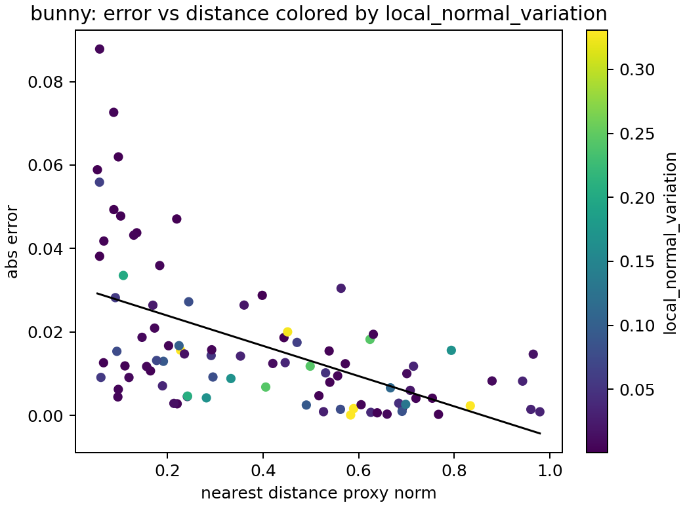

**Figure.** For Bunny, distance remains the dominant visual trend; normal variation adds weaker secondary structure.

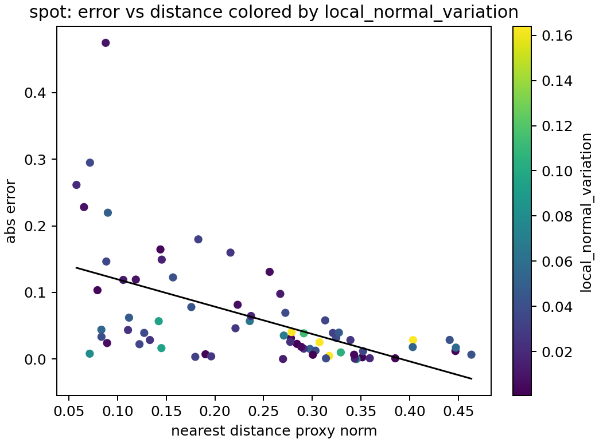

**Figure.** For Spot, error also decreases with distance, while local normal variation remains a secondary descriptive signal rather than a standalone explanation.

| Mesh | Feature | Pearson | Spearman | Partial | n |
|---|---|---|---|---|---|
| bunny | nearest_distance_proxy_norm | -0.54952 | -0.60464 | NA | 90 |
| bunny | local_normal_variation | -0.20786 | -0.24805 | -0.15574 | 90 |
| bunny | local_edge_mean_norm | 0.01998 | 0.11434 | 0.09981 | 90 |
| bunny | local_aspect_ratio | -0.04958 | -0.05433 | 0.05390 | 90 |
| spot | nearest_distance_proxy_norm | -0.55225 | -0.61568 | NA | 70 |
| spot | local_normal_variation | -0.19575 | -0.03544 | -0.12736 | 70 |
| spot | local_edge_mean_norm | 0.02044 | 0.06550 | 0.14350 | 70 |
| spot | local_aspect_ratio | 0.08318 | 0.10375 | -0.00668 | 70 |

| Mesh | Term | Std beta | R2 | n |
|---|---|---|---|---|
| bunny | nearest_distance_proxy_norm | -0.00959 | 0.33283 | 90 |
| bunny | local_normal_variation | -0.00289 | 0.33283 | 90 |
| bunny | local_edge_mean_norm | 0.00100 | 0.33283 | 90 |
| bunny | local_aspect_ratio | 0.00185 | 0.33283 | 90 |
| spot | nearest_distance_proxy_norm | -0.04613 | 0.32354 | 70 |
| spot | local_normal_variation | -0.00596 | 0.32354 | 70 |
| spot | local_edge_mean_norm | 0.00763 | 0.32354 | 70 |
| spot | local_aspect_ratio | -0.00144 | 0.32354 | 70 |

In this descriptive regression/correlation pass, local normal variation shows additional descriptive signal after controlling for distance. The regression models are small and should be treated as exploratory: `error ~ nearest_distance + local_normal_variation + local_edge_mean + local_aspect_ratio`.

### Interpretation

- Spot remains higher-error than Bunny in matched normalized-distance bins 1-3, so the controlled run supports residual mesh, shape, reflection, or normal-error effects after reducing the query-distance confounder.
- The gap shrinks with distance: Spot/Bunny error ratio is about `3.38x` in bin 1, `3.68x` in bin 2, and `1.37x` in bin 3. That pattern suggests query-distance distribution was a major confounding factor in the original cross-mesh comparison, but it does not explain all of the difference.
- Boundary bias is also larger for Spot in matched bins 1-3, while mean steps are not uniformly larger after matching distance; Spot has fewer steps than Bunny in bins 2-3.
- Bunny and Spot alone cannot separate mesh quality, shape, scale, and reflection behavior, so this should be read as controlled empirical support, not causal proof.

### Limitations

- Nearest-distance is still a nearest-centroid proxy, not exact signed distance or true local feature-size distance.
- Bunny and Spot alone cannot prove universal geometry causality.
- Stronger causal claims require same-shape remeshed variants or synthetic stress-test meshes.
- Spot bin 4 is unavailable in this controlled setup, so far-from-boundary matched conclusions are incomplete.

### Controlled Output Files

- `distance_controlled_query_counts.csv`
- `distance_controlled_neumann.csv`
- `distance_controlled_bias.csv`
- `matched_bin_summary.csv`
- `matched_bin_comparison.csv`
- `epsilon_distance_sweep.csv`
- `epsilon_distance_heatmaps/`
- `controlled_geometry_correlations.csv`
- `geometry_regression_summary.md`

## Final Report and Poster Consolidation

### Concise Claims

1. Dirichlet validation shows normal Monte Carlo convergence on the reproduced Bunny and Spot runs, so the basic estimator and comparison setup are credible.
2. Mixed Neumann behavior is geometry-sensitive: error, variance, path length, and boundary-bias indicators depend strongly on boundary proximity.
3. Normalized nearest-surface distance is the strongest pointwise predictor observed across error, variance, steps, and bias diagnostics.
4. Distance-controlled bins show Spot remains higher-error than Bunny in matched bins 1-3, but the gap shrinks with distance.
5. Epsilon x distance sweeps show coarse epsilon induces boundary bias, especially near the boundary.
6. Antithetic sampling, lazy refinement, adaptive sampling, BVH acceleration, and live path tracing should be framed as diagnostics and optimization-aware tools, not as universal accuracy guarantees.

### Poster Figure Recommendations

The figures below are the most poster-ready visual sequence. Use one or two controlled plots as the main evidence, then use convergence/diagnostic plots as supporting panels.

**Caption.** Under matched normalized distance bins, Spot remains higher-error than Bunny in bins 1-3, but the gap narrows in farther bins.

**Caption.** Boundary-bias indicators are largest near the inner boundary and are consistently higher for Spot in matched bins.

**Caption.** Coarse epsilon amplifies error most strongly near the boundary, separating boundary bias from pure Monte Carlo variance.

**Caption.** Live path traces provide qualitative evidence for long reflection-heavy paths near difficult Neumann boundary regions.

| Figure | Use | One-sentence caption |
|---|---|---|
| `controlled_geometry_experiments_20260606/plots/matched_bins_bunny_vs_spot_abs_error.png` | Main controlled result | Under matched normalized distance bins, Spot remains higher-error than Bunny in bins 1-3, but the gap narrows in farther bins. |
| `controlled_geometry_experiments_20260606/plots/distance_bin_vs_mean_boundary_bias.png` | Boundary-bias support | Boundary-bias indicators are largest near the inner boundary and are consistently higher for Spot in matched bins. |
| `controlled_geometry_experiments_20260606/epsilon_distance_heatmaps/*_epsilon_vs_distance_rmse.png` | Epsilon diagnosis | Coarse epsilon amplifies error most strongly near the boundary, separating boundary bias from pure Monte Carlo variance. |
| `rerun_cross_mesh_20260606/zombie_*_dirichlet/rmse_vs_walks_comparison.png` | Validation panel | Dirichlet benchmarks show expected convergence, validating the baseline setup before studying Neumann sensitivity. |
| `rerun_cross_mesh_20260606/zombie_*_neumann/neumann_rmse_vs_walks_comparison.png` | Neumann contrast | Mixed Neumann convergence is less uniform than Dirichlet convergence and depends strongly on geometry and boundary interaction. |
| `rerun_cross_mesh_20260606/wost_*/diagnostics/variance_adaptive_tradeoff.png` | Optimization/diagnostics panel | Adaptive sampling is best framed as a variance diagnostic and allocation tool rather than a universal improvement in every region. |
| `rerun_cross_mesh_20260606/wost_spot/diagnostics/live_trace_plot.png` | Qualitative trace | Live path traces provide qualitative evidence for long reflection-heavy paths near difficult Neumann boundary regions. |

### Final Limitations

These results support a cautious geometry-sensitive interpretation, not a universal causal theorem. The normalized nearest-distance variable is a nearest-centroid proxy rather than exact signed distance or local feature size. Bunny and Spot differ in shape, scale, triangulation density, normal variation, and feasible query distribution, so controlled bins reduce but do not eliminate confounding. Stronger causal claims require same-shape remeshed variants, controlled normal perturbations, or synthetic stress-test geometries with known boundary-distance and curvature structure.

### Avoid-Overclaiming Checklist

- Do not claim WoSt is always more accurate than Zombie; the safe claim is that Dirichlet validates normal convergence while Neumann behavior is more sensitive.
- Do not claim Spot difficulty is caused only by mesh quality; distance distribution, shape, reflection behavior, and normal estimates are still entangled.
- Do not claim local normal variation alone explains error; nearest-boundary distance is the strongest stable predictor in these runs.
- Do not claim exact distance-to-boundary analysis; the current distance is a nearest-surface proxy.
- Do not claim universal geometry causality from Bunny and Spot alone.
- Do not present adaptive sampling, antithetic sampling, lazy refinement, BVH, or live tracing as guaranteed accuracy improvements.
- Do not use smoke-test outputs as evidence in the final poster or report.

### Two-Minute Presentation Script

I start from a reproduced Walk-on-Stars pipeline and ask where it is reliable and where it becomes sensitive. The first sanity check is Dirichlet: on Bunny and Spot, the Dirichlet experiments show the expected Monte Carlo convergence, which gives us confidence that the implementation and comparison pipeline are behaving normally.

The interesting behavior appears in the mixed Neumann setting. The same solver becomes much more geometry-sensitive: errors, variance, mean path length, and boundary-bias indicators all increase near the inner boundary. In the pointwise analysis, normalized nearest-surface distance is the strongest and most stable predictor. Local mesh features matter less consistently on their own.

To test whether the Spot-vs-Bunny gap was just a query-distribution artifact, I ran a distance-controlled experiment. I sampled queries from the same normalized distance bins on each mesh. Spot still has higher error than Bunny in matched bins 1-3: about 3.38x in bin 1, 3.68x in bin 2, and 1.37x in bin 3. So Spot remains harder after matching distance, but the gap shrinks as we move away from the boundary. That means the original query distribution was a major confounder, but not the whole story.

The epsilon-by-distance sweep adds the second piece. Coarse epsilon creates large boundary bias, especially in close bins. Reducing epsilon helps, but close-boundary residual error can remain high, suggesting remaining effects from reflection behavior, shape, normals, or mesh geometry.

The takeaway is cautious: Dirichlet validates the estimator; mixed Neumann exposes geometry-sensitive behavior; boundary proximity is the strongest predictor; and the optimization tools help diagnose and control the computation rather than proving universal superiority.

## Files

- `mesh_feature_comparison.csv`
- `all_point_geometry_features.csv`
- `geometry_correlations.csv`
- `geometry_binned_summaries.csv`
- `benchmark_sensitivity_summary.csv`
- `figures/`
