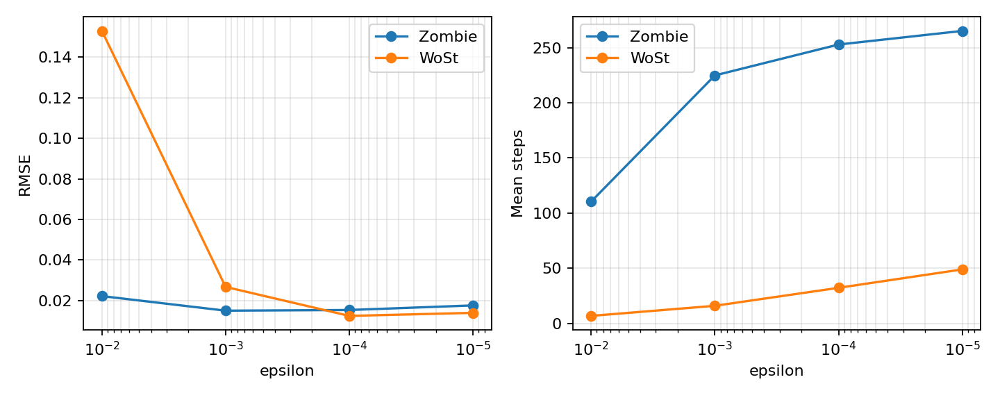

# Zombie vs WoSt Mixed Neumann Bunny Benchmark

Generated on 2026-06-02.

## Data Sources

- Zombie baseline: `C:\THU\projects\WoSt_Final_project-1\experiments\rerun_cross_mesh_20260606\zombie_bunny_neumann`
- WoSt reference: `C:\THU\projects\WoSt_Final_project-1\experiments\rerun_cross_mesh_20260606\wost_bunny\results`
- PDE: `Delta u = 0`, analytic solution `u=x+y+z`
- Boundary setup: outer cube Dirichlet, inner Bunny Neumann
- Zombie solver: `WalkOnStars` with FCPW geometry queries

## Figures

WoSt reference plots copied for local viewing:

## Convergence Comparison

| Walks | Zombie RMSE | WoSt RMSE | Zombie / WoSt | Zombie mean steps | WoSt mean steps |
|---:|---:|---:|---:|---:|---:|
| 16 | 0.03739 | 0.04140 | 0.903 | 249.87 | 30.93 |
| 64 | 0.01931 | 0.02497 | 0.773 | 246.84 | 33.52 |
| 256 | 0.01599 | 0.01308 | 1.222 | 246.45 | 34.46 |
| 1024 | 0.01404 | 0.01141 | 1.231 | 245.96 | 34.47 |

## Epsilon Comparison

| Epsilon | Zombie RMSE | WoSt RMSE | Zombie / WoSt | Zombie mean steps | WoSt mean steps |
|---:|---:|---:|---:|---:|---:|
| 1e-02 | 0.02224 | 0.15294 | 0.145 | 110.43 | 6.75 |
| 1e-03 | 0.01505 | 0.02676 | 0.562 | 224.78 | 15.90 |
| 1e-04 | 0.01539 | 0.01249 | 1.233 | 252.78 | 32.21 |
| 1e-05 | 0.01765 | 0.01398 | 1.262 | 265.13 | 48.88 |

## Structured Grid

| Metric | Zombie | WoSt |
|---|---:|---:|
| RMSE | 0.01128 | 0.01196 |
| Mean steps | 140.54 | 19.62 |

Relevant VTK files:

- Zombie: `neumann_mixed_grid.vtk`, `neumann_mixed_pointcloud.vtk`
- WoSt: `C:\THU\projects\WoSt_Final_project-1\experiments\rerun_cross_mesh_20260606\wost_bunny\results\neumann_mixed_grid.vtk`

## Notes

- Zombie and WoSt both show decreasing RMSE as walk count increases.
- The epsilon sweep shows the expected cost/accuracy tradeoff through increasing mean steps.
- Neumann handling is more sensitive to normal convention, reflection details, and max walk length than the Dirichlet-only benchmark, so this is primarily a mixed-boundary baseline comparison rather than a bitwise-equivalent implementation comparison.
