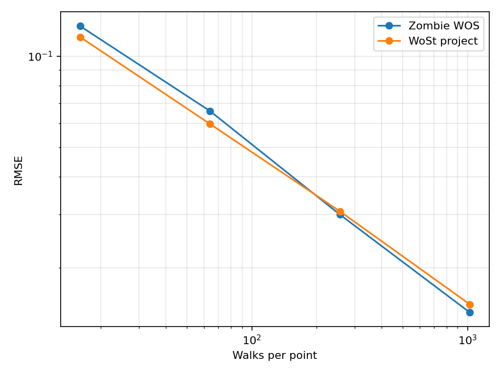
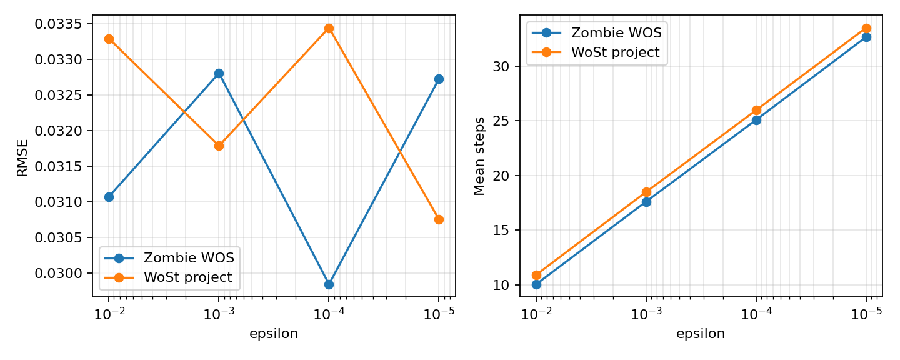
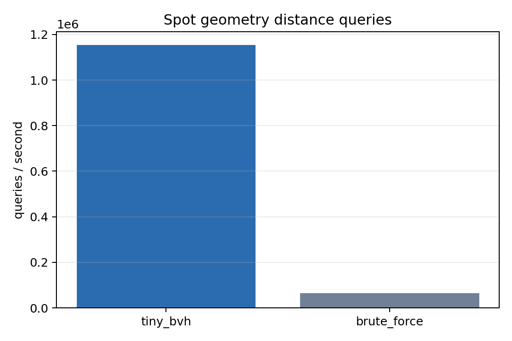
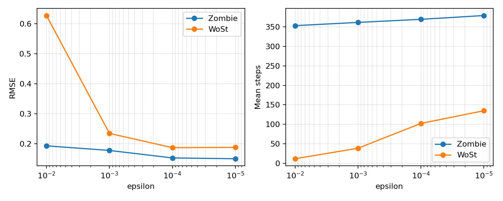
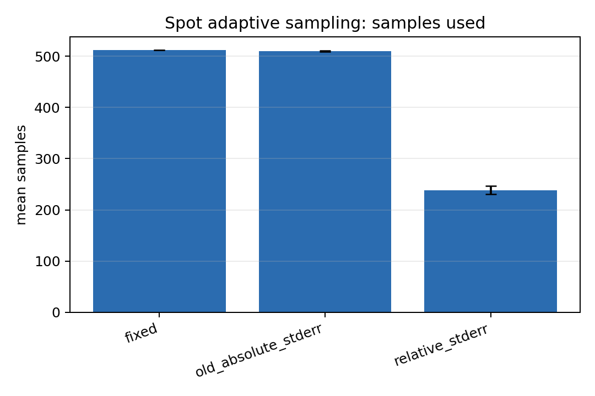
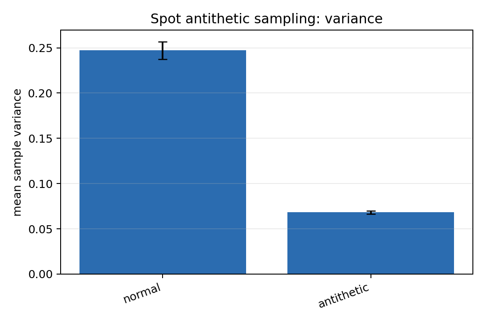
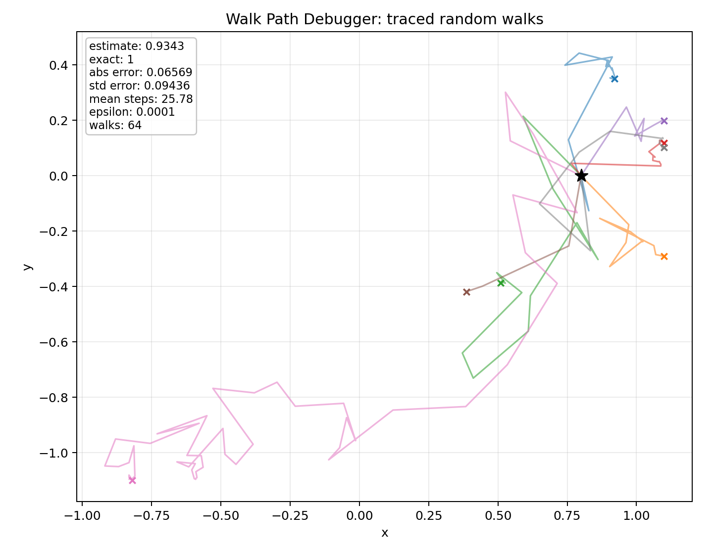
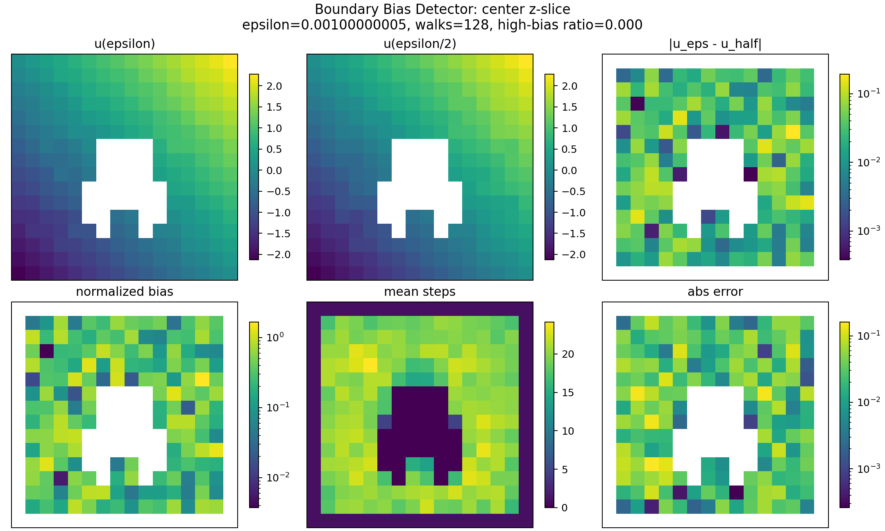
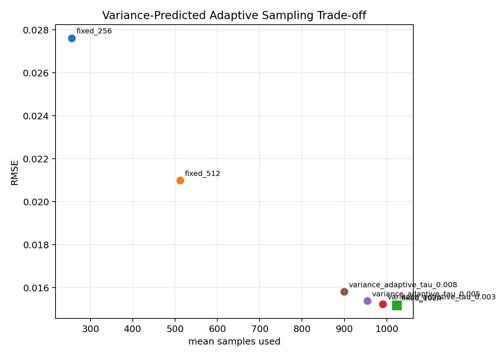
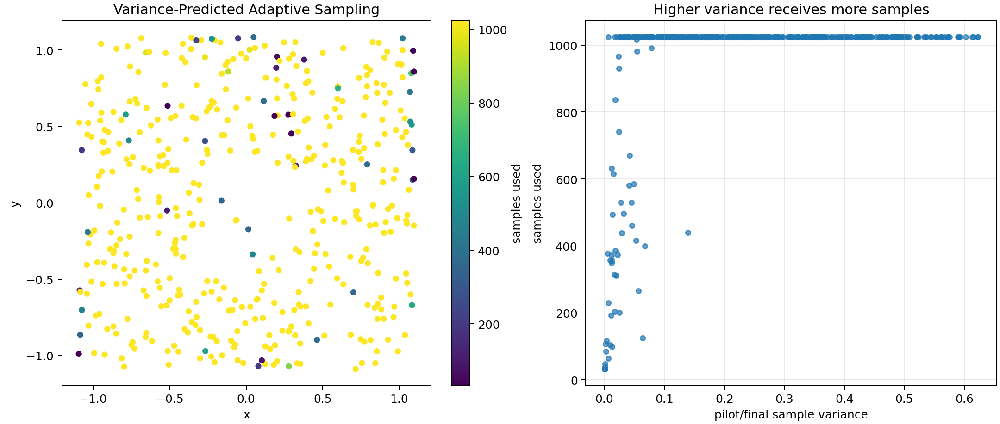

# Spot Mesh Experiment Report: WoSt and Zombie Re-run

Generated on 2026-06-03. This report reruns the major experiments from `experiments/final_integrated_report.md` on `spot/spot_triangulated.obj`.

## Setup

- Mesh: Spot triangular mesh
- Vertices: 2,930
- Faces: 5,856
- Bounding box min: `[-0.471552, -0.736784, -0.668909]`
- Bounding box max: `[0.471552, 0.953646, 1.049000]`
- Outer cube half extent: `1.1`
- Exact solution: `u(x,y,z)=x+y+z`, `Delta u=0`
- Output folder: `experiments/spot_mesh_report_20260603/`

## Commands Used

```powershell
Push-Location experiments\spot_mesh_report_20260603
..\..\build\Release\wost.exe --mode convergence --obj ..\..\spot\spot_triangulated.obj --queries 500 --threads 8 --seed 54321 --cube 1.1
..\..\build\Release\wost.exe --mode epsilon --obj ..\..\spot\spot_triangulated.obj --queries 500 --threads 8 --seed 54321 --cube 1.1
..\..\build\Release\wost.exe --mode grid --obj ..\..\spot\spot_triangulated.obj --grid 16 --threads 8 --seed 54321 --cube 1.1
..\..\build\Release\wost.exe --mode geometry --obj ..\..\spot\spot_triangulated.obj --queries 500 --threads 8 --seed 54321 --cube 1.1
..\..\build\Release\wost.exe --mode neumann --obj ..\..\spot\spot_triangulated.obj --queries 100 --grid 8 --threads 8 --seed 64321 --cube 1.1
..\..\build\Release\wost.exe --mode optimization --obj ..\..\spot\spot_triangulated.obj --queries 500 --threads 8 --seed 74321 --cube 1.1 --max-samples 512 --min-samples 64 --batch-size 32 --target-rse 0.05 --rse-eps 0.001
Pop-Location
```

Zombie baselines were run as read-only scripts with outputs under `zombie_dirichlet/` and `zombie_neumann/`.

## Dirichlet WoSt vs Zombie

| Walks | Zombie RMSE | WoSt RMSE | Zombie/WoSt | Zombie time | WoSt time |
|---|---|---|---|---|---|
| 16 | 0.12587 | 0.11582 | 1.087 | 0.13 | 0.11 |
| 64 | 0.06596 | 0.05978 | 1.103 | 0.52 | 0.43 |
| 256 | 0.03002 | 0.03078 | 0.976 | 2.05 | 1.68 |
| 1024 | 0.01426 | 0.01517 | 0.940 | 8.14 | 6.66 |



Observation: both solvers show clean Monte Carlo convergence on Spot. WoSt is slightly better at 16/64 walks, while Zombie is slightly better at 256/1024 walks; the differences are small.

### Dirichlet Epsilon Sweep

| Epsilon | Zombie RMSE | WoSt RMSE | Zombie/WoSt | Zombie time | WoSt time |
|---|---|---|---|---|---|
| 0.01 | 0.03107 | 0.03329 | 0.933 | 1.19 | 2.00 |
| 0.001 | 0.03281 | 0.03179 | 1.032 | 1.70 | 2.08 |
| 0.0001 | 0.02984 | 0.03344 | 0.892 | 2.16 | 2.40 |
| 1e-05 | 0.03273 | 0.03075 | 1.064 | 2.58 | 2.50 |



## Geometry Query Microbenchmark

| Backend | Queries/s | Time (s) | Checksum |
|---|---|---|---|
| tiny_bvh | 1,153,935 | 0.000433 | 230.565 |
| brute_force | 64,848 | 0.007710 | 230.565 |



Observation: Spot is much smaller than Bunny, so brute force is less catastrophic, but tiny_bvh is still about 17.8x faster than brute force.

## Mixed Neumann WoSt vs Zombie

| Walks | Zombie RMSE | WoSt RMSE | Zombie/WoSt | Zombie steps | WoSt steps | Zombie time | WoSt time |
|---|---|---|---|---|---|---|---|
| 16 | 0.53373 | 0.25217 | 2.117 | 354.5 | 107.9 | 4.08 | 0.27 |
| 64 | 0.31045 | 0.19335 | 1.606 | 366.8 | 104.4 | 16.90 | 1.14 |
| 256 | 0.18426 | 0.17442 | 1.056 | 367.9 | 107.6 | 65.30 | 4.57 |
| 1024 | 0.08007 | 0.16710 | 0.479 | 367.8 | 106.2 | 259.03 | 17.86 |


Observation: Spot Neumann is much harder than Dirichlet. WoSt is substantially faster and uses shorter paths, but Zombie achieves lower RMSE at 1024 walks in this run.

### Neumann Epsilon Sweep

| Epsilon | Zombie RMSE | WoSt RMSE | Zombie/WoSt | Zombie steps | WoSt steps |
|---|---|---|---|---|---|
| 0.01 | 0.19283 | 0.62693 | 0.308 | 353.1 | 11.7 |
| 0.001 | 0.17747 | 0.23421 | 0.758 | 361.4 | 38.6 |
| 0.0001 | 0.15249 | 0.18677 | 0.816 | 369.3 | 102.3 |
| 1e-05 | 0.14985 | 0.18768 | 0.798 | 379.1 | 134.8 |



Observation: WoSt again shows strong coarse-epsilon Neumann bias at `epsilon=1e-2`. Reducing epsilon improves WoSt substantially, but Spot remains a more challenging Neumann geometry than Bunny.

## WoSt Optimization Diagnostics on Spot

| Experiment | Method | RMSE mean | Mean samples | Mean variance | Runtime mean |
|---|---|---|---|---|---|
| adaptive_compare | fixed | 0.02206 | 512.00 | 0.24832 | 3.37 |
| adaptive_compare | old_absolute_stderr | 0.02206 | 509.59 | 0.24832 | 3.38 |
| adaptive_compare | relative_stderr | 0.03996 | 238.60 | 0.24304 | 1.63 |
| antithetic_compare | antithetic | 0.01622 | 512.00 | 0.06820 | 3.39 |
| antithetic_compare | normal | 0.02238 | 512.00 | 0.24709 | 3.41 |
| lazy_refinement | full_exact | 0.02194 | 512.00 | 0.24617 | 26.43 |
| lazy_refinement | lazy_threshold_x1 | 0.02194 | 512.00 | 0.24617 | 3.32 |
| lazy_refinement | lazy_threshold_x16 | 0.02194 | 512.00 | 0.24617 | 10.82 |
| lazy_refinement | lazy_threshold_x4 | 0.02194 | 512.00 | 0.24617 | 6.81 |






Key conclusions: relative RSE adaptive sampling reduces mean samples from 512 to roughly 232--247 but increases RMSE; antithetic sampling strongly reduces sample variance; lazy refinement preserves RMSE while cutting runtime from about 26.4s to about 3.3s at threshold x1.

## Final Innovation Demo Modes on Spot

### Walk Path Debugger

| Quantity | Value |
|---|---|
| point | (0.8, 0.0, 0.2) |
| walks | 64 |
| estimate | 0.93431 |
| exact | 1.00000 |
| abs error | 0.06569 |
| std error | 0.09436 |
| mean steps | 25.78 |
| runtime | 0.0043 s |



### Boundary Bias Detector

| Quantity | Value |
|---|---|
| epsilon | 0.00100000005 |
| epsilon_half | 0.000500000024 |
| walks | 128 |
| grid | 16 |
| valid points | 3876 |
| mean bias | 0.02392 |
| max bias | 0.20125 |
| mean normalized bias | 0.25332 |
| RMSE epsilon | 0.03901 |
| RMSE epsilon/2 | 0.03839 |



### Variance-Predicted Adaptive Sampling

| Method | RMSE | Mean samples | Runtime |
|---|---|---|---|
| fixed_256 | 0.02762 | 256.00 | 2.41 |
| fixed_512 | 0.02099 | 512.00 | 4.72 |
| fixed_1024 | 0.01518 | 1024.00 | 7.96 |
| variance_adaptive_tau_0.003 | 0.01523 | 990.47 | 6.60 |
| variance_adaptive_tau_0.005 | 0.01538 | 954.20 | 6.37 |
| variance_adaptive_tau_0.008 | 0.01581 | 899.57 | 6.11 |





Observation: unlike Bunny, the Spot variance predictor allocates near the maximum sample budget for most points. This suggests Spot has higher or more spatially widespread estimator variance under the same target standard error.

## Cross-Mesh Takeaways

- The Dirichlet accuracy story is stable across Bunny and Spot: both Zombie and WoSt converge and agree closely.
- The Neumann story is mesh-sensitive. Spot produces longer/harder reflected-path behavior and larger residual Neumann error for WoSt at high sample counts.
- The boundary-bias detector remains useful: Spot shows larger mean bias than the Bunny demo under the same grid/walk setting (`0.0239` vs. Bunny `0.0060`).
- Variance-predicted adaptive sampling is not universally sample-saving at the same target: on Spot, tau values 0.003--0.008 all allocate near the upper budget, revealing a harder variance landscape.
- Antithetic sampling and lazy star-radius refinement remain strong optimization diagnostics on Spot.