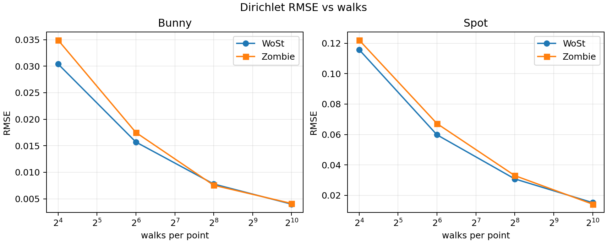
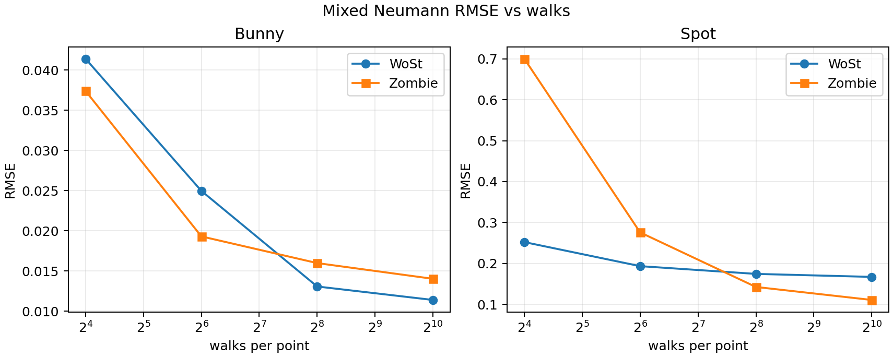
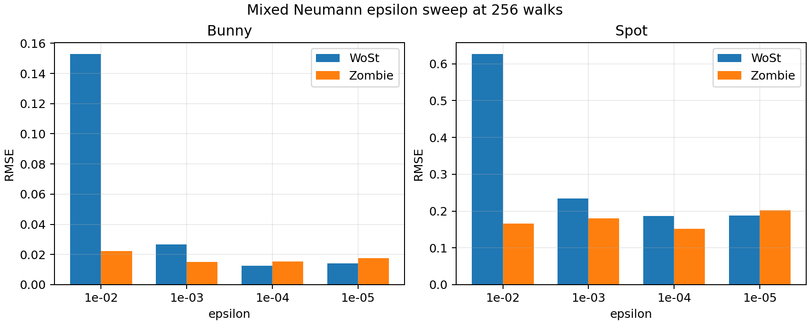
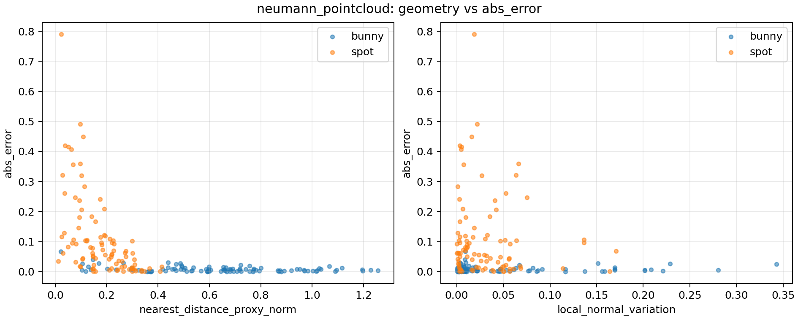
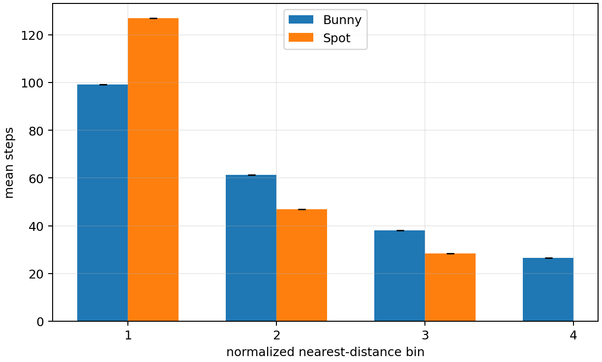
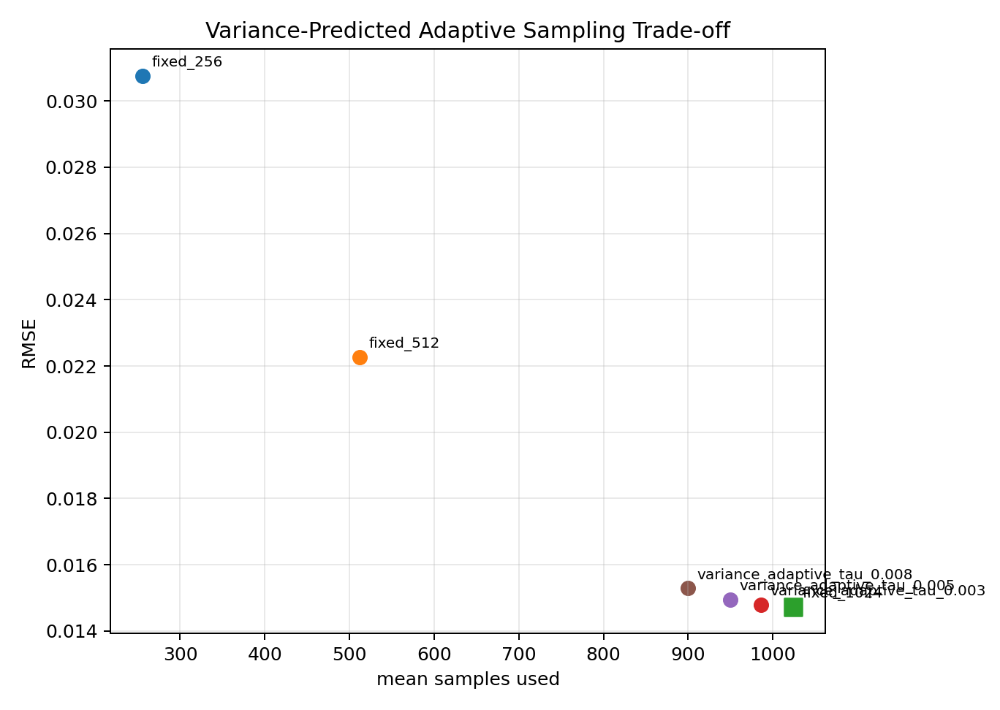
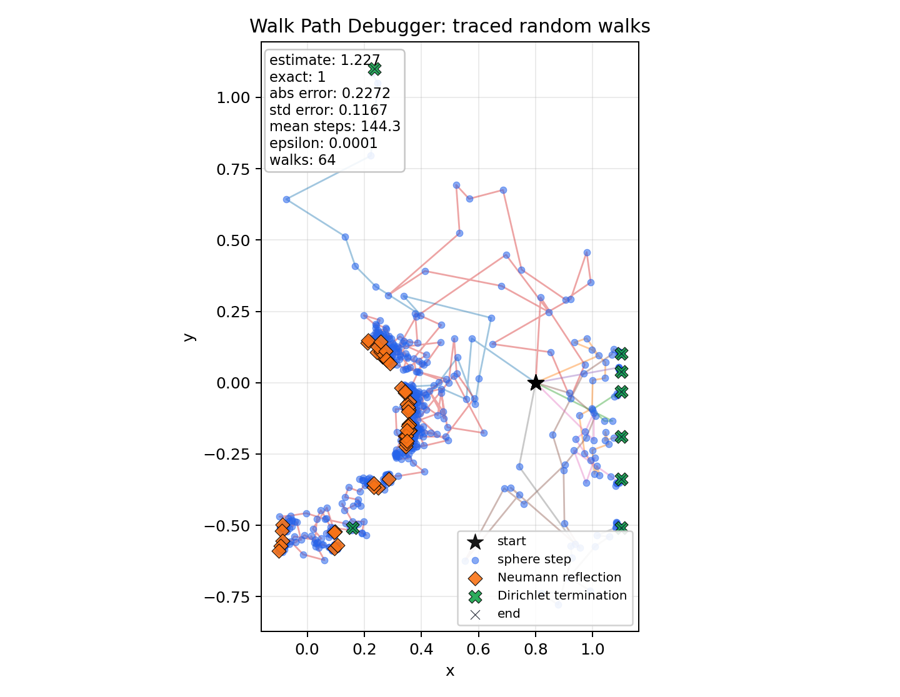
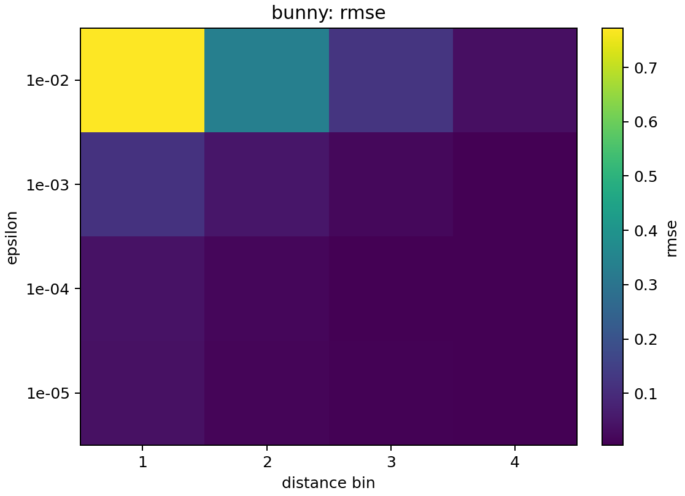
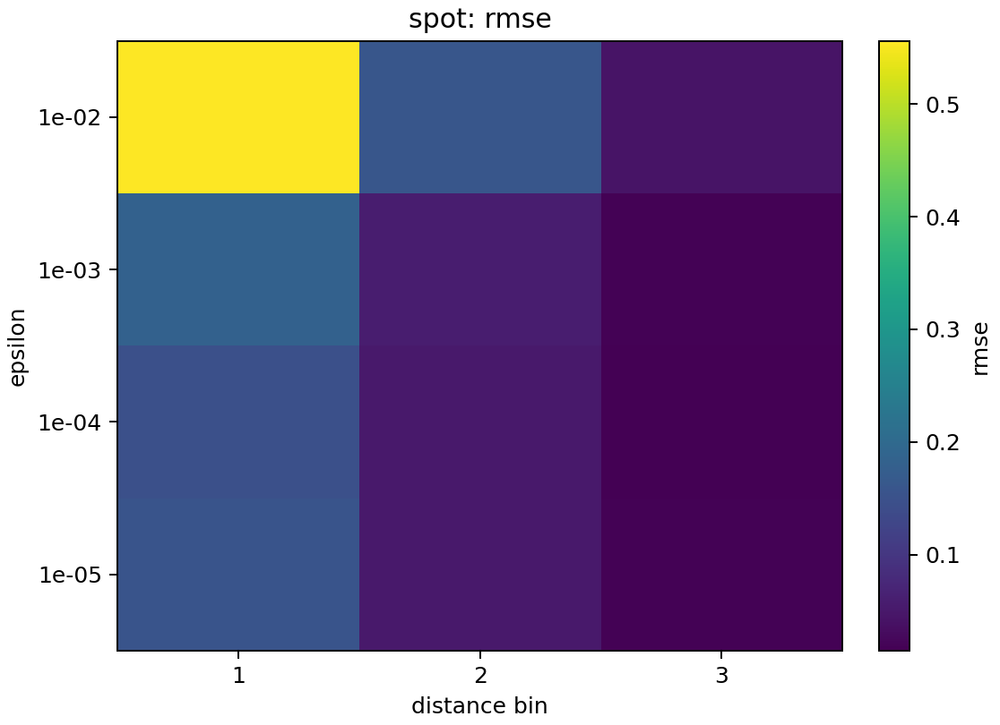

# Final Course Report: Geometry-Sensitive Walk-on-Stars under Mixed Neumann Boundary Conditions

## Abstract / Executive Summary

This report studies how a reproduced and extended Walk-on-Stars (WoSt) implementation behaves on Bunny and Spot meshes, with emphasis on mixed Neumann boundary conditions. The Dirichlet experiments serve as a sanity check: WoSt and the Zombie baseline show ordinary Monte Carlo convergence. Mixed Neumann experiments are more sensitive: error, variance, path length, and the epsilon-vs-half-epsilon boundary-bias indicator depend strongly on query placement near the inner boundary. Geometry-sensitive diagnostics identify the normalized nearest-surface-distance proxy as the strongest available pointwise predictor. A distance-controlled experiment reduces the query-distance confounder and shows that Spot remains higher-error than Bunny in matched bins 1-3, but the gap shrinks with distance. Optimization tools are useful for diagnosis and engineering, but they are not presented as general accuracy improvements.

## 1. Introduction and Research Question

**Research question:** How does Walk-on-Stars behave under mixed Neumann boundary conditions, and how are its errors affected by boundary proximity, epsilon, and mesh geometry?

The main scientific issue is that Neumann boundary handling depends on reflection and surface normals rather than simple boundary termination. This makes the solver more sensitive to local geometry and to how close query points are to the boundary. The goal is not to declare one solver globally better, but to identify where and why the mixed Neumann setting becomes difficult.

## 2. Background

A boundary value problem asks for a function inside a domain subject to conditions on the boundary. Dirichlet conditions prescribe the function value on the boundary; random-walk solvers can terminate at the boundary and evaluate that value. Neumann conditions prescribe normal derivative information. In a mixed setting, part of the boundary uses Dirichlet values and part uses Neumann reflection or derivative contributions.

Walk-on-Stars is a random-walk Monte Carlo method for solving PDE-style boundary value problems. Instead of stepping on a regular grid, it samples larger geometry-aware jumps. In a Dirichlet problem, each path is mostly a termination-and-estimation process. In a mixed Neumann problem, paths may interact repeatedly with the inner boundary, and errors can arise from reflection behavior, normal estimation, epsilon termination, and local mesh quality.

## 3. Methods and Experimental Setup

- **WoSt implementation:** C++ implementation in this repository, run through `build/Release/wost.exe`.
- **Zombie baseline:** Python-driven Zombie baseline under `C:/THU/homework/zombie`, used for cross-method comparison.
- **Meshes:** Bunny (`obj/Bunny.obj`) and Spot (`spot/spot_triangulated.obj`). Spot is coarser in normalized edge length and has higher normal variation in the geometry-sensitive analysis.
- **Query sampling:** Standard rerun queries are random/grid-based depending on the benchmark. Controlled experiments sample query points by normalized nearest-surface-distance proxy bins.
- **Walk counts:** Main convergence sweeps use 16, 64, 256, and 1024 walks per point.
- **Epsilon:** Main epsilon sweeps use 1e-2, 1e-3, 1e-4, and 1e-5.
- **Metrics:** RMSE, mean steps, sample variance, mean samples, and epsilon-vs-half-epsilon boundary-bias indicator.
- **Nearest-distance proxy:** The geometry analysis uses a normalized nearest-surface-distance proxy based on nearest triangle/centroid-style geometry features. It should not be read as exact signed distance.

## 4. Experiment 1: Dirichlet Sanity Check

**Main claim:** the Dirichlet experiments show ordinary Monte Carlo behavior on both meshes, validating the baseline pipeline before interpreting mixed Neumann sensitivity.

The Dirichlet panels show that increasing walks reduces RMSE for both Bunny and Spot, and WoSt/Zombie agreement is close across the tested walk counts. This is the sanity check: the later Neumann difficulty is not simply a failed experiment pipeline.

## 5. Experiment 2: Mixed Neumann Sensitivity

**Main claim:** mixed Neumann behavior is less uniform than Dirichlet behavior and is strongly mesh-sensitive.

Bunny shows improvement with more walks, but the high-walk Neumann error does not drop as cleanly as the Dirichlet case. Spot is substantially harder: WoSt RMSE remains high even at larger walk counts.

### Why can Zombie outperform WoSt on Spot at high walk counts?

In Spot mixed Neumann convergence, Zombie has lower RMSE than WoSt at higher walk counts. At 256 walks, Spot Zombie RMSE is `0.14248` while WoSt RMSE is `0.17442`; at 1024 walks, Zombie RMSE is `0.11072` while WoSt RMSE is `0.16710`. WoSt uses much shorter mean paths than Zombie, but shorter paths do not guarantee lower error. This suggests possible residual systematic error from reflection, epsilon handling, local geometry, or implementation differences. This remains an important limitation and future investigation point.

## 6. Experiment 3: Epsilon and Boundary-Bias Indicator

**Main claim:** coarse epsilon can dominate mixed Neumann error, and the epsilon-vs-half-epsilon boundary-bias indicator is larger on Spot.

The epsilon sweep shows much larger RMSE at coarse epsilon in the mixed Neumann setting. The boundary-bias indicator compares epsilon and half-epsilon estimates; it is an epsilon sensitivity indicator, not an exact bias decomposition. It is spatially and mesh dependent, which is consistent with the later controlled distance-bin results.

## 7. Experiment 4: Geometry-Sensitive Pointwise Diagnostics

**Main claim:** the normalized nearest-surface-distance proxy is the strongest observed pointwise predictor of high error, high variance, long paths, and boundary-bias indicators.

The geometry-sensitive analysis shows that points close to the inner boundary are consistently harder. Local normal variation and related mesh features are useful secondary descriptors, but they are not a standalone explanation. This motivates distance-controlled comparisons before attributing the Bunny/Spot gap to mesh geometry alone.

## 8. Experiment 5: Distance-Controlled Bins

**Main claim:** Spot remains higher-error than Bunny in matched bins 1-3, but the gap shrinks with distance.

The controlled experiment samples query points by normalized nearest-surface-distance proxy bins. Spot remains higher-error in matched bins 1-3, with descriptive Spot/Bunny error ratios of about 3.38x, 3.68x, and 1.37x. This supports residual mesh, shape, reflection, or normal effects after reducing the query-distance confounder. However, the shrinking ratio shows that query-distance distribution was a major confounding factor. Spot bin 4 is unavailable, so far-boundary matched conclusions are incomplete.

### Controlled matched-bin ratios

| bin | Spot/Bunny error | Spot/Bunny bias indicator | Spot/Bunny steps | status |
|---|---|---|---|---|
| 1 | 3.383 | 3.334 | 1.280 | descriptive matched-bin ratio |
| 2 | 3.685 | 2.371 | 0.7649 | descriptive matched-bin ratio |
| 3 | 1.371 | 1.833 | 0.7462 | descriptive matched-bin ratio |
| 4 | NA | NA | NA | missing mesh/bin pair |

### Recomputed per-query matched-bin statistics

| mesh | bin | n | mean abs err | std | SE | 95% CI | RMSE | mean steps | mean var | mean bias indicator |
|---|---|---|---|---|---|---|---|---|---|---|
| bunny | 1 | 21 | 0.0357 | 0.0238 | 0.0052 | [0.0255, 0.0459] | 0.0426 | 99.088 | 0.0435 | 0.0156 |
| bunny | 2 | 22 | 0.0152 | 0.0110 | 0.0024 | [0.0106, 0.0198] | 0.0186 | 61.227 | 0.0363 | 0.0147 |
| bunny | 3 | 23 | 0.0120 | 0.0087 | 0.0018 | [0.0084, 0.0155] | 0.0147 | 37.956 | 0.0316 | 0.0129 |
| bunny | 4 | 24 | 0.0060 | 0.0060 | 0.0012 | [0.0036, 0.0084] | 0.0084 | 26.626 | 0.0199 | 0.0069 |
| spot | 1 | 22 | 0.1209 | 0.1165 | 0.0248 | [0.0722, 0.1695] | 0.1660 | 126.84 | 0.6902 | 0.0520 |
| spot | 2 | 24 | 0.0561 | 0.0505 | 0.0103 | [0.0359, 0.0763] | 0.0748 | 46.831 | 0.2288 | 0.0348 |
| spot | 3 | 24 | 0.0164 | 0.0154 | 0.0032 | [0.0102, 0.0226] | 0.0223 | 28.322 | 0.1083 | 0.0237 |

## 9. Diagnostic and Optimization Tools

Adaptive sampling, antithetic sampling, lazy refinement, BVH acceleration, and live tracing are best framed as engineering and diagnostic tools. Adaptive sampling exposes where variance concentrates and how sample allocation changes. Antithetic sampling reduces variance in the reported diagnostic rows. Lazy refinement and BVH acceleration improve runtime behavior in the tested setup. Live traces give qualitative insight into path behavior. None of these results should be read as guaranteed accuracy improvements for every mesh or boundary condition.

## 10. Discussion

The main lesson is that Monte Carlo PDE solvers can look healthy under Dirichlet validation while becoming much more sensitive under mixed Neumann conditions. Dirichlet paths terminate at boundary values; mixed Neumann paths interact with normals and reflection behavior. That interaction makes boundary proximity, epsilon termination, and local mesh geometry more important.

The strongest available pointwise signal is the normalized nearest-distance proxy. Mesh features such as local normal variation are plausible contributors, especially for a coarse mesh such as Spot, but Bunny and Spot alone do not isolate causality. The unresolved Spot high-walk anomaly is especially important: Zombie can outperform WoSt on Spot at high walk counts even though WoSt uses shorter paths. That points to residual systematic effects rather than pure Monte Carlo variance.

## 11. Practical Takeaways

- Run Dirichlet sanity checks before interpreting Neumann results.
- Treat near-boundary mixed Neumann queries as high-risk.
- Avoid coarse epsilon near the boundary.
- Use adaptive sampling as a diagnostic of variance concentration.
- Use live traces to inspect difficult path behavior.
- Do not assume shorter paths imply better accuracy.

## 12. Limitations

- Only Bunny and Spot are tested in the controlled cross-mesh analysis.
- Nearest-distance is a proxy, not exact signed distance.
- Matched-bin valid sample counts are small, and matched-bin ratios are descriptive.
- Spot bin 4 is missing in the controlled distance-bin experiment.
- Fixed seeds and limited repeated-seed statistics restrict uncertainty analysis.
- No same-shape remeshing or synthetic geometry stress tests were run.
- The epsilon-vs-half-epsilon boundary-bias value is an indicator, not a true exact-solution bias decomposition.

## 13. Claim-Evidence-Limitation Table

| Claim | Evidence | Limitation / caution |
|---|---|---|
| Dirichlet validation | Bunny and Spot Dirichlet RMSE decreases with walks in Figure 1 and the Zombie/WoSt summary CSVs. | This validates the baseline pipeline, not every boundary condition. |
| Mixed Neumann geometry sensitivity | Figure 2 and Neumann tables show less uniform convergence and larger Spot errors. | Bunny and Spot differ in shape, mesh resolution, and query distribution. |
| Boundary proximity is the strongest observed predictor | Geometry correlations and pointwise scatter plots identify normalized nearest-distance proxy as the strongest stable predictor. | The variable is a nearest-distance proxy, not exact signed distance. |
| Spot remains harder after distance matching | Controlled bins 1-3 show Spot/Bunny error ratios of about 3.38x, 3.68x, and 1.37x. | Ratios are descriptive; Spot bin 4 is missing and repeated-seed confidence intervals are not available. |
| Coarse epsilon induces boundary-sensitive error | Epsilon sweep and boundary-bias indicator figures show much larger error/indicator values at coarse epsilon. | The epsilon-vs-half-epsilon value is an indicator, not an exact bias decomposition. |
| Optimization tools are diagnostic, not general fixes | Adaptive, antithetic, lazy refinement, BVH, and live-trace outputs expose variance/runtime/path behavior. | They should not be presented as guaranteed accuracy improvements. |

## 14. Conclusion

The reproduced WoSt pipeline passes the basic Dirichlet sanity check, but mixed Neumann boundary conditions reveal strong geometry sensitivity. Boundary proximity and epsilon handling explain a large part of the error structure. Controlled distance bins show that Spot remains harder than Bunny in matched bins 1-3, while the shrinking gap confirms that the original query-distance distribution was a major confounder. The safest final interpretation is therefore not that one method or mesh property fully explains the behavior, but that mixed Neumann WoSt requires careful boundary-distance, epsilon, and geometry diagnostics.

## Appendix A. Full Tables and Derived Assets

- `reports/final_assets/controlled_matched_bin_statistics.csv`
- `reports/final_assets/controlled_matched_bin_ratios.csv`
- `reports/final_report_provenance.md`
- Source reports: `experiments/rerun_cross_mesh_20260606/RERUN_SUMMARY.md`, `experiments/geometry_sensitive_analysis_20260606/GEOMETRY_SENSITIVE_REPORT.md`, `experiments/controlled_geometry_experiments_20260606/CONTROLLED_GEOMETRY_REPORT.md`

## Appendix B. Extra Diagnostic Figures

The BVH figure is supporting engineering evidence for acceleration inside the WoSt implementation; it is not used as a solver-accuracy claim.

## Appendix C. File Provenance

See `reports/final_report_provenance.md` for source files, generated assets, and where each is used.
